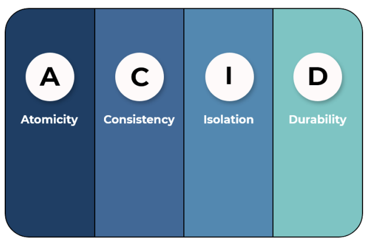

# 트랜잭션의 특징 - ACID

> 트랜잭션은 원자성, 일관성, 독립성, 지속성의 특징을 가지고, 이를 묶어 ACID 특징이라고 한다

### 원자성 (Atomicity)

- All or Nothing
- 트랜잭션과 관련된 일이 모두 수행되었거나 되지 않았거나를 보장하는 특징

### 일관성 (Consistency)

- '허용된 방식'으로만 데이터를 변경해야 한다

### 격리성(Isolation)

- 트랜잭션 수행 시 서로 끼어들지 못하는 것을 의미

### 지속성 (durability)

- 성공적으로 수행된 트랜잭션은 영원히 반영되어야 한다
- 이는 데이터베이스에 장애가 발생해도 원래 상태로 복구하는 회복 기능이 있어야 함을 뜻하며, 데이터베이스는 이를 위해 체크섬, 저널링, 롤백 등의 기능을 제공

#### 용어 정리

##### 체크섬

- 중복 검사의 한 형태로 오류 정정을 통해 송신된 자료의 무결성을 보호하는 방법

##### 저널링

- 파일 시스템 또는 데이터베이스 시스템에 변경 사항을 반영(commit)하기 전에 로깅하는 것. 트랜잭션 등 변경 사항에 대한 로그를 남기는 것

##### 무결성

- 데이터의 정확성, 일관성, 유효성을 유지하는 것. 무결성이 유지되어야 데이터베이스에 저장된 데이터 값과 그 값에 해당하는 현실 세계의 실제 값이 일치하는지에 대한 신뢰가 생긴다

- `개체 무결성`: 기본키로 선택된 필드는 빈 값을 허용하지 않는다
- `참조 무결성`: 서로 참조 관계에 있는 두 테이블의 데이터는 항상 일관된 값을 유지해야 한다
- `고유 무결성`: 특정 속성에 대해 고유한 값을 가지도록 조건이 주어진 경우, 그 속성 값은 모두 고유한 값을 가진다
- `NULL 무결성`: 특정 속성 값에 대해 NULL이 올 수 없다는 조건이 주어진 경우, 그 속성 값은 NULL이 될 수 없다
