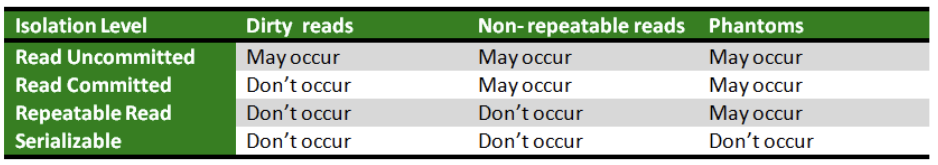
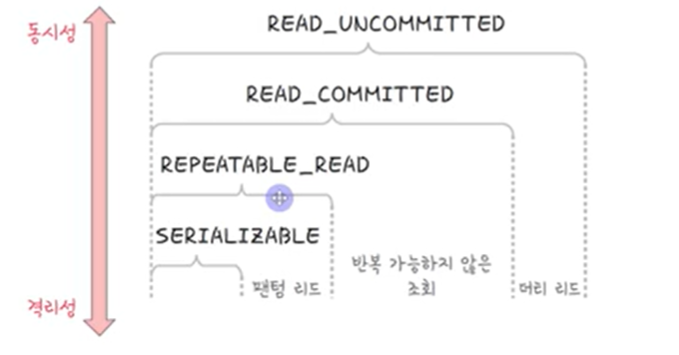

# 트랜잭션의 격리성

- 트랜잭션은 서로 끼어지 못하지만, 무조건 서로 접근이 불가능한것은 아님
- 격리성은 여러 단계가 있으며, 해당 단계에 따라 격리성과 동시성의 정도가 다르다

- 트랜잭션이 순차적으로 실행이 되면 격리성은 높아지지만 동시성은 너무 낮아져서 성능이 안좋아진다
- `격리성`과 `동시성`은 반비례관계

=> DB에서 이 단계를 조정할 수 있다

ex) MySQL에서는 다음과 같은 명령어로 단계를 조절

```sql
set session transaction isolation level read uncommitted;
```

- 격리수준의 종류는 다음과 같고, 격리 수준에 따라 팬텀리드, 반복가능하지 않은 조회, 더티리드와 같은 현상이 발생하기도 한다

- SERIALIZABLE: 격리성 가장 높음. 순차적으로 트랜잭션 수행하여 트랜잭션 간섭으로 인한 이상 현상 발생하지 않는다
- REPEATABLE_READ: 팬텀리드 현상 발생
- READ_COMMITED: 팬텀리드, 반복가능하지 않은 조회 현상 발생
- READ_UNCOMMITED: 팬텀리드, 반복가능하지 않은 조회, 더티 리드 현상 발생




