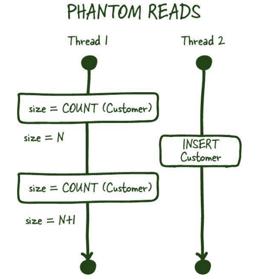
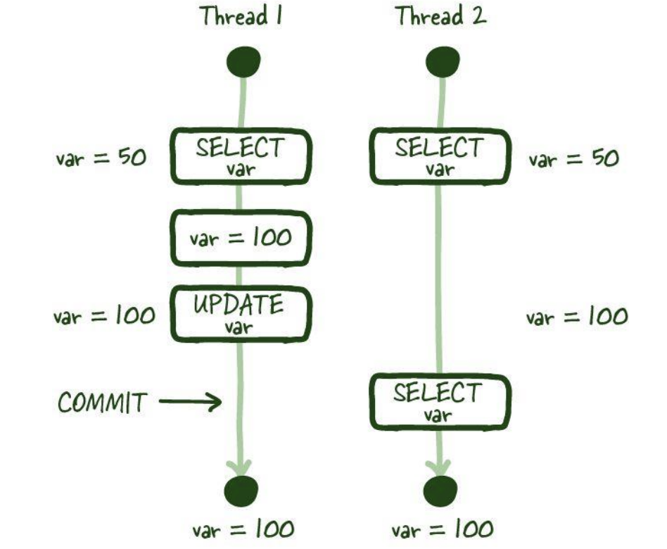
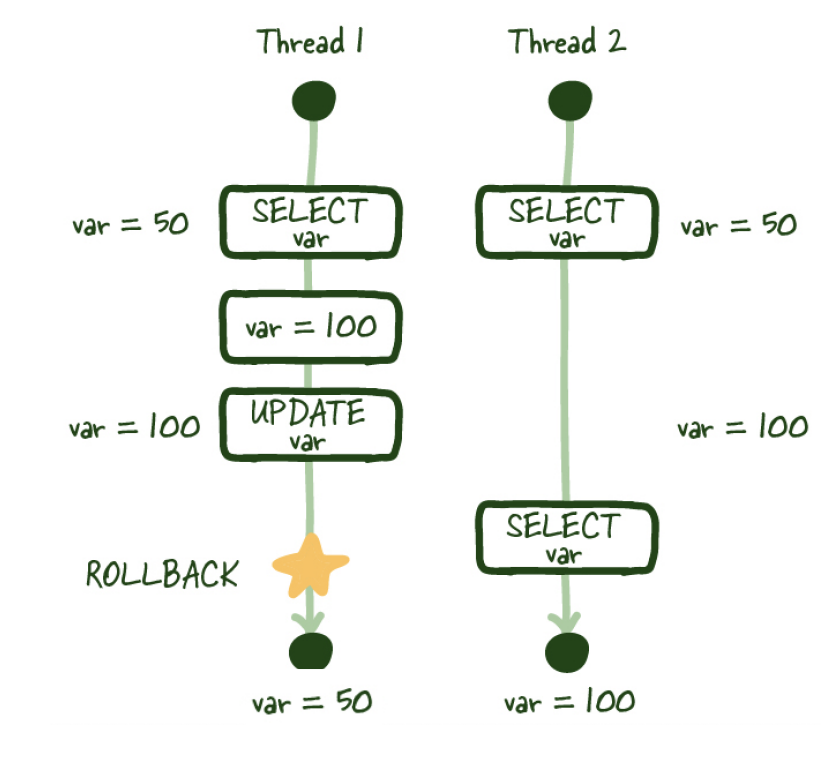

# 트랜잭션의 격리수준에 따른 이상 현상 (팬텀리드, 더티리드 등)

### 팬텀리드(phantom reads)

- 팬텀 = 유령. 행이 유령같이 생기거나 사라져 버렸다는 뜻
- 한 트랜잭션 내에서 동일한 쿼리를 2번 이상 보냈을 때, 해당 조회 결과가 다른 것

### 반복 가능하지 않은 조회(Non Repeatable Reads)

- 한 트랜잭션 내의 같은 행에 두 번 이상 조회가 발생했는데 그 값이 다른 것
- 여러 번 조회했을 때 그 값이 달라지는 것

### 더티리드 (Dirty Read)

- 하나의 트랜잭션이 다른 트랜잭션의 아직 커밋되지 않은 데이터를 읽는 현상

- T1이 업데이트 이후 롤백을 하여 커밋하지 않은 데이터가 됬음에 도 불구하고 T2는 이미 커밋이 되었다라고 판단

