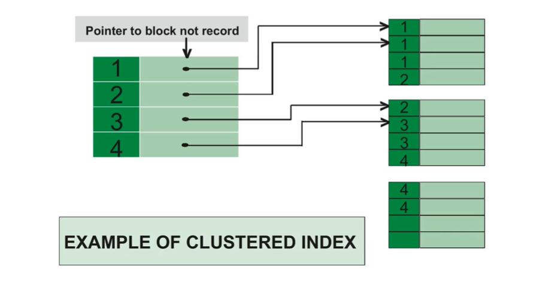
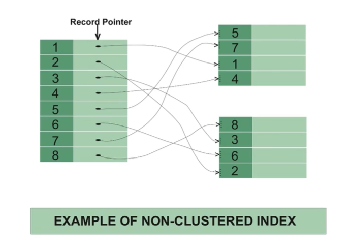

# Clustered index와 Non-clustered index와의 차이

### Clustered Index

- 클러스터형 인덱스, 유일성과 최소성을 가지는 기본키 중 하나로 설정
- 테이블 당 한개로 보통 테이블의 기본키가 클러스터형 인덱스가 된다
- 데이터페이지가 정렬되어 저장되며, 인덱스 페이지의 리프노드에 "데이터페이지"가 들어가 있음. 정렬 되었기 때무에 탐색에 장점
- 데이터가 추가될 때마다 다시 모든 테이블을 정렬해야 하기 때문에 삽입, 삭제, 수정이 느림
- 인덱스의 순서와 데이터의 순서가 일치

> 클러스터형 인덱스 생성 방법: primary key (alter table add primary key)

### Non-Clustered Index

- 보조인덱스, 하나가 아닌 여러개를 만들 수 있음
- 클러스터형 키가 복합키가 될 수도 있기는 하나, 보통 복합키를 만든다고 했을 때 (compound key) 보조 인덱스로 만듦
  - 클러스터형과는 달리 인덱스 페이지 리프노드에 실제 데이터가 있는 것이 아니라 데이터 페이지에 관한 포인터가 존재
  - 정렬되어 있지 않아서 탐색은 느리나, 삽입, 삭제, 수정이 빠름
- 인덱스의 순서와 데이터의 순서가 일치하지 않음

> 보조 인덱스 만드는 방법 create index.... alter table add index

#### 주의

- primary key로 설정한다고 해서 클러스터형 인덱스로 무조건 설정되는 것은 MySQL 한정. SQL 서버 같은 경우 primary key로 설정해도 보조 인덱스로 설정
