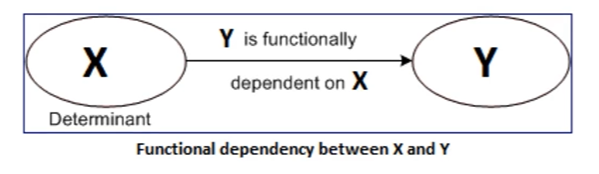
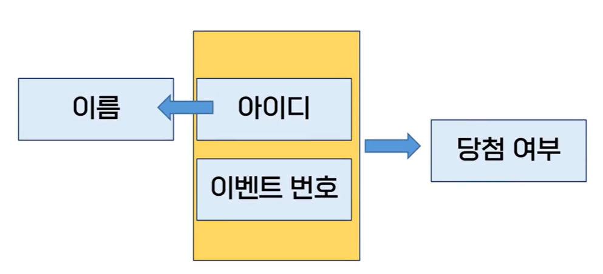

# 데이터베이스 정규화 과정

## 개념과 이상현상

### 정규화 과정

- 릴레이션간의 잘못된 함수 종속 관계로 인해 데이터베이스 이상 현상이 발생하는 것을 해결하는 과정
- 저장 공간을 효울적으로 사용하기 위해 릴레이션을 여러 개로 분리하는 과정

### 이상현상 (anomaly)

> 데이터베이스의 설계를 잘못하게 되었을 때 불필요한 데이터 중복이 발생하여 릴레이션에 대한 데이터의 삽입, 갱신, 삭제 (CUD) 연산을 수행할 때 부작용이 발생하게 되는 것

- 관련없는 속성들이 하나의 릴레이션이 모였을 때 발생하는 것이 이상현상, 이를 해결하는 척도가 되는 것이 **함수 종속**
- 릴레이션간의 관련성을 함수 종속성을 통해 파악하고 이를 기준으로 릴레이션을 분리하는 **정규화 과정**을 진행해야 한다

#### 삽입 이상

- 불필요한 데이터도 같이 삽입해야 하는 문제
- 회원 가입만 한 참가자인데 이벤트 참여일자, 이벤트 당첨 여부 column을 기입해야함

#### 갱신 이상

- 중복 레코드가 있고, 이 중 일부만 변경해 데이터 자체가 불일치 되는 문제

#### 삭제 이상

- 레코드를 삭제하는데 필요한 데이터까지 삭제되는 문제
- 이벤트 참여를 취소했을 뿐인데 고객 아이디, 이름 같은 회원정보까지 삭제 필요

## 함수적 종속성

- 어떤 릴레이션을 구성하는 속성의 부분집합이 X,Y라고 할 때 하나의 X에 대해 Y가 하나라면 X가 Y를 함수적으로 결정한다 또는 Y가 X에 함수적으로 종속되었다 라는 관계를 가짐
- 이 때 X는 결정자, Y는 종속자

### 함수적 종속성 예시

- 아이디(고유값)는 이름과 등급을 결정
- 이름과 등급은 아이디에 함수적 종속성을 가짐
- 아이디 -> {이름, 등급}

### 완전함수종속과 부분함수 종속

- {아이디, 이벤트번호} -> 당첨여부
- 아이디 -> 이름

- 완전함수 종속은 Y가 X 전체에 종속된 것, 부분함수 종속은 Y가 X 일부에 종속된 것
- 이름은 아이디에 완전 종속되어 있지만, 이름은 {아이디, 이벤트번호}에는 부분함수 종속
- 딩첨여부는 {아이디, 이벤트번호}에 완전함수 종속
