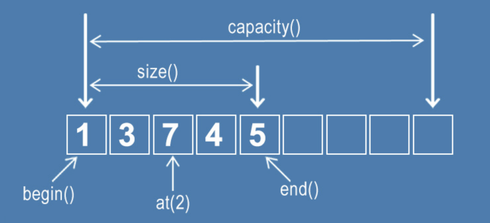

# 동적 배열 (vector)

- 동적으로 요소를 할당할 수 있는 배열
- 컴파일 시점에 사용해야 할 요소들의 개수를 모른다면 vector를 사용해야 한다
- 연속된 메모리 공간에 위치한 같은 타입의 요소들의 모음
- 숫자 인덱스 기반으로 랜덤 접근 가능
- 중복 허용

### 1. 동적 배열의 시간 복잡도



- 참조: O(1)
- 탐색: O(n)
- 삽입/삭제
  - 맨 끝에 삽입/삭제: O(1)
  - 맨 끝 제외 삽입/삭제: O(n)

```java
List<Integer>
```

### 2. vector의 정적 할당

- vector라고 해서 무조건 크기가 0인 빈 vector를 만들어 동적 할당으로 요소를 추가하는 것은 아님
- 애초에 크기를 정해두거나, 해당 크기에 대하 어떠한 값으로 초기화해놓고 시작해도 된다
