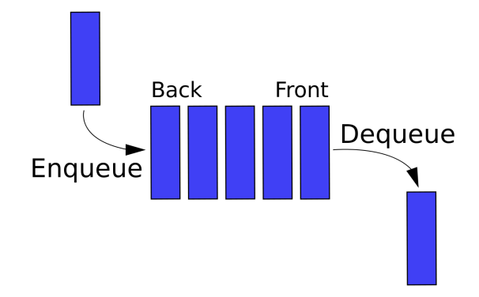

# 큐 (Queue)

> 먼저 집어넣은 데이터가 먼저 나오는 성질인 선입선출 (FIFO, First In First Out)을 지닌 자료구조
> 나중에 집어넣은 데이터가 먼저 나오는 스택과는 반대 개념 CPU 작업을 기다리는 프로세스, 스레드 행렬 또는 네트워크 접속을 기다리는 행렬, 너비우선탐색, 캐시 등에 사용된다

- MQ (message queue)가 대표적
  - 대규모 트래픽으로 인해 서비스 과부하가 발생했을 때 MQ를 사용하여 순차적으로 트래픽을 해결, 서비스 과부하 방지하는 장치

### 1. 시간복잡도

- n번쨰 참조: O(n)
- 가장 앞 부분 참조: O(1)
- 탐색: O(n)
- 맨 뒤에 삽입/맨 앞에 삭제: O(1)



### 2. Java 큐(Queue) 관련 메서드 정리

- 선언

```java
import java.util.Queue;
import java.util.LinkedList;

Queue<자료형> queue = new LinkedList<>();
```

- 메서드

| 종류                       | method                 | 반환값                                                     |
| -------------------------- | ---------------------- | ---------------------------------------------------------- |
| 삽입                       | queue.add(value);      | 삽입 성공 시 true, 실패시 exception                        |
| 삽입                       | queue.offer(value);    | 삽입 성공 시 true 실패 시 false                            |
| 삭제                       | queue.remove();        | 삭제한 value. 빈 queue의 경우 NoSuchElementException       |
| 삭제                       | queue.remove(value);   | value가 존재하고 지웠으면 true 존재하지 않으면 false       |
| 삭제                       | queue.poll();          | 삭제한 value. 빈 queue면 null 반환                         |
| 맨앞원소 반환              | queue.element();       | 큐 head에 위치한 value, 빈 Queue 면 NoSuchElementException |
| 맨앞원소 반환              | queue.peek();          | 큐 head에 위치한 value, 빈 Queue 면 null 반환              |
| 큐 초기화                  | queue.clear();         | 반환값 없음                                                |
| 크기                       | queue.size();          | 큐에 저장된 value의 개수                                   |
| 빈 큐인지 확인           | queue.isEmpty();       | true/false                                                 |
| 특정 value 존재하는지 확인 | queue.contains(value); | true/false                                                 |
