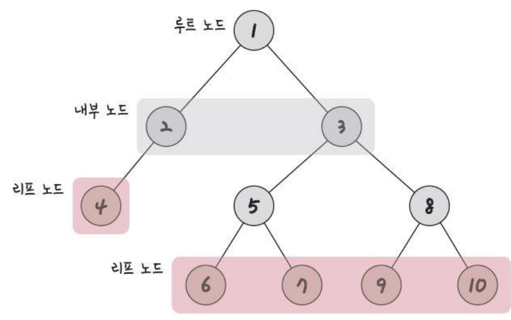
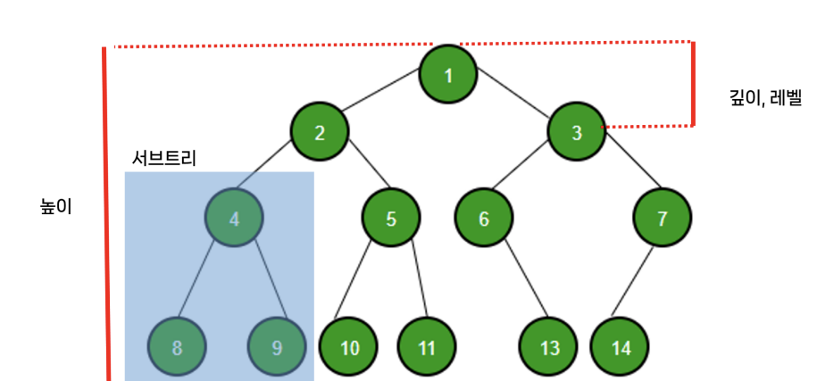

# 트리 (Tree Data Structure)

> 자식노드와 부모노드로 이루어진 계층적인 구조를 가지며, 무방향 그래프의 일종이자, 사이클이 없는 자료구조를 의미

- 무방향 그래프 vs 방향 그래프 (단방향 그래프, 양방향 그래프)

### 1. 트리의 특징

- 그래프의 일종
- 부모, 자식 계층 구조를 가짐. 같은 경로 상에서 어떤 노드보다 위에 있으면 부모, 아래에 있으면 자식 노드가 됨
- `V(vertex=node)-1 = E(edge)`라는 특징 존재. 간선 수는 노드 수 - 1
- 임의의 두 노드 사이의 경로는 '유일무이'하게 '존재'
- 트리 내의 어떤 노드와 어떤 노드까지의 경로는 반드시 있으며 단 하나만 존재

### 2. 루트노드

- 가장 위에 있는 노드
- 보통 트리문제가 나오고, 트리를 탐색할 때 루트 노드를 중심으로 탐색하면 문제가 쉽게 풀리는 경우가 많다

### 3. 내부 노드

- 루트노드와 리프노드 사이에 있는 노드

### 4. 리프노드

- 자식 노드가 없는 노드

### 5. 트리의 높이와 레벨

- 깊이 : 트리에서의 깊이는 각각의 노드마다 다르며, 루트 노드에서 특정 노드까지 최단거리로 갔을 때의 거리를 뜻함

  - ex) 4번 노드의 깊이 = 2

- 높이: 루트 노드부터 리프 노드까지의 거리 중 가장 긴 거리

  - ex) 위 트리의 높이 = 3

- 레벨: 문제마다 조금씩 다르지만 보통 깊이와 같은 의미를 가짐.

  - ex) 1번 노드를 0레벨, 2번 노드, 3번 노드를 1레벨로 할 수도 있고, 1번 노드를 1레벨, 2,3번 노드를 2레벨로 할 수도 있다

- 서브트리: 트리 내의 하위 집합. 트리 내에 있는 부분집합
  - ex) 4, 8, 9번 노드가 이 트리의 하위집합으로 "서브트리"
    에 해당

### 6. 숲(forest)

- 트리로 이루어진 집합
