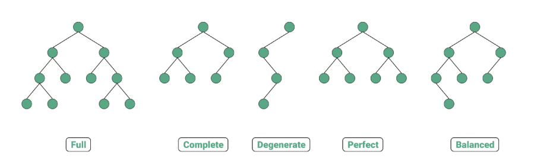
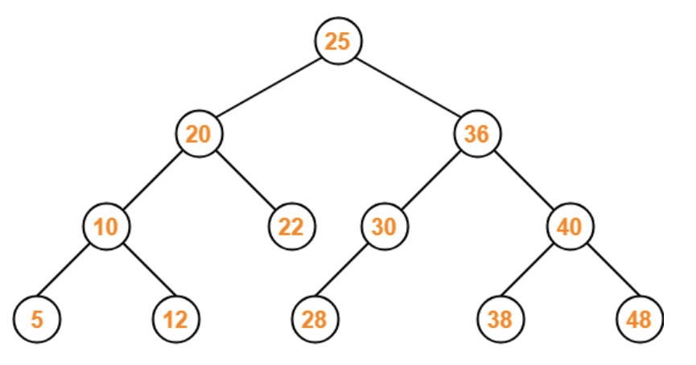
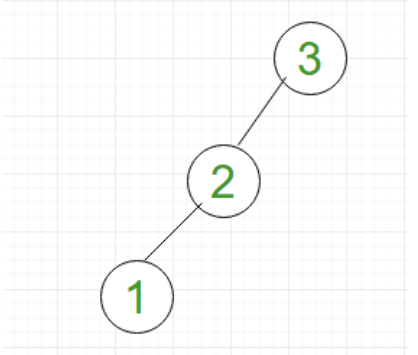

# 이진트리(Binary Tree)와 이진탐색트리(BST)

> 각 노드의 자식 노드 수가 2개 이하로 구성되어 있는 트리

### 1. 이진 트리의 분류

- 정이진트리(full binary tree): 자식 노드가 0개 또는 2개인 이진 트리
- 완전이진트리(complete binary tree): 왼쪽에서부터 채워져있는 이진트리. 마지막 레벨을 제외하고는 모든 레벨이 완전히 채워져 있으며, 마지막 레벨의 경우 왼쪽부터 채워져 있음
- 변질이진트리(degenerate binary tree): 자식 노드가 하나밖에 없는 이진 트리
- 포화이진트리(perfect binary tree): 모든 노드가 꽉 차있는 이진 트리
- 균형이진트리(balanced binary tree): 모든 노드의 왼쪽 하위 트리와 오른쪽 하위 트리의 깊이 차이가 1 이하인 트리. map, set을 구성하는 레드블랙트리는 균형이진트리 중 하나

### 2. 이진탐색트리(BST, Binary Search Tree)

> 이진 트리의 일종으로, 노드의 오른쪽 하위 트리에는 "노드의 값보다 큰 값"이 있는 노드만 포함되고, 왼쪽 하위트리에는 "노드의 값보다 작은 값"이 들어있는 트리

> 

- "검색"을 하기에 용이. 왼쪽에는 작은 값, 오른쪽에는 큰 값이 이미 정해져있기 때문에 10이라는 값을 찾으려 한다면 25의 왼쪽 노드를만 찾아도 된다 -> 전체 탐색을 하지 않아도 된다

### 3. 이진탐색트리의 시간복잡도?

- 균형잡힌 이진 탐색트리라면, 탐색, 삭제, 수정 모두 `O(logN)`

- 하지만 삽입 순서에 따라 달라짐

  - ex) 1,2,3 순서로 삽입이 되었다면 아래와 같이 선형적(linear)인 자료구조가 되어버림

    

- 즉, 이진 탐색 트리는 삽입 순서에 따라 영향을 받음
- 하지만 삽입 순서가 어떻게 되는 트리의 노드들을 회전시키는 등의 방법을 통해서 "균형잡히게 만든" 이진 탐색 트리에서 발전된 트리로는 AVL 트리, 레드블랙트리가 있음
- map이라는 자료구조는 삽입,탐색,수정의 시간 복잡도가 모두 O(logN)임을 보장받는데 , 그 이유가 균형잡힌 트리인 레드블랙트리를 기반으로 구현되어 있기 때문
