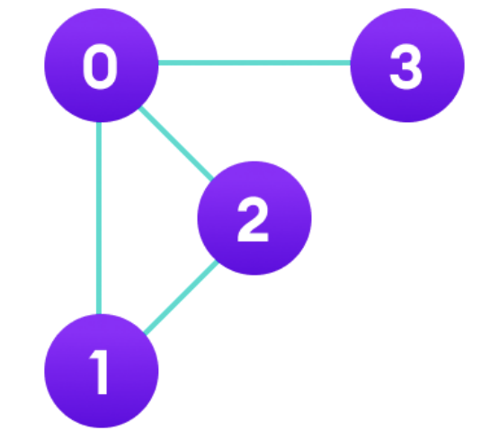
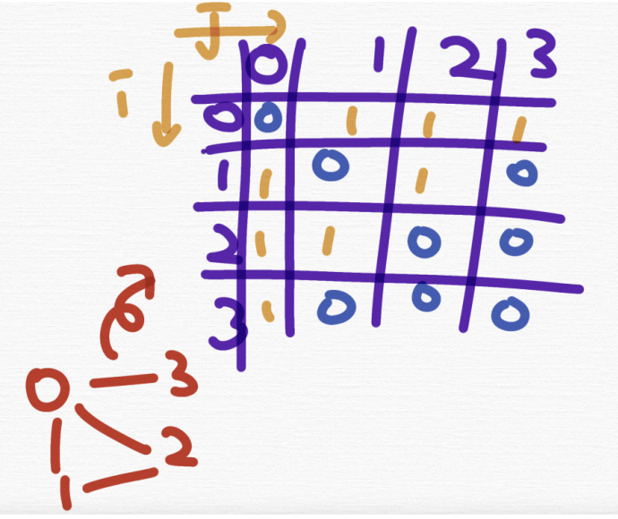

# 인접행렬 (adjacency matrix)

> 그래프를 어떻게 컴퓨터에 알려줄 수 있을까? -> 인접 행렬과 인접 리스트 사용

- 참조: 무방향 그래프는 양방향 그래프로 볼 수 있음

### 1. 인접 행렬

> 그래프에서 정점과 간선의 관계를 나타내는 bool 타입의 정사각형 행렬

- 정사각형 행렬의 각 요소가 0 또는 1의 값을 가짐. 0은 두 정점 사이의 경로가 없음을 의미하며, 1은 두 정점 사이의 경로가 있음을 의미
- 자신과 자신간의 경로의 경우 사이클이 없을 때는 0, 사이클이 있을 때는 1로 표기
- 인접행렬의 가로=세로의 길이=노드의 수

#### 연습




```cpp
bool a[4][4] = {
{0, 1, 1, 1},
{1, 0, 1, 0},
{1, 1, 0, 0},
{1, 0, 0, 0},
};
```

```java
a[0][1] = 1
```

- 0 노드에서 1노드로 가는 간선이 존재한다

```java
a[3][2] = 0
```

- 3노드에서 2노드로 가는 간선이 존재하지 않는다
