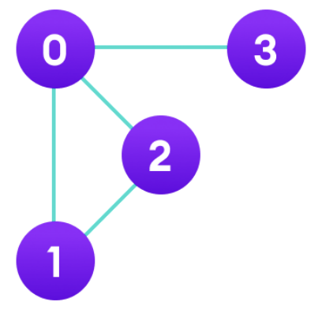
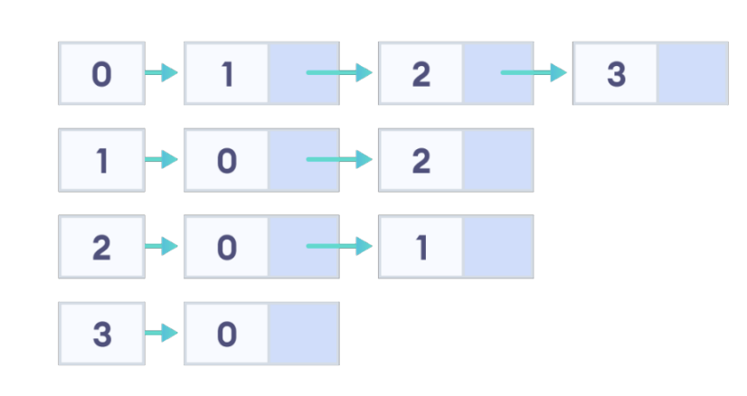

# 인접 리스트(adjacency list)

> 그래프에서 정점과 간선의 관계를 나타내는 연결 리스트 여러 개



- 정점마다 연결 리스트를 만들고, 연결된 정점들을 연결시킨다
  

```cpp
#include<bits/stdc++.h>
using namespace std;
const int V = 4;
vector<int> adj[V]; // 노드 수만큼 백터 생성
int main(){
    adj[0].push_back(1);
    adj[0].push_back(2);
    adj[0].push_back(3);

    adj[1].push_back(0);
    adj[1].push_back(2);

    adj[2].push_back(0);
    adj[2].push_back(1);

    adj[3].push_back(0);

    for(int i = 0; i < 4; i++){
      cout << i << " :: ";
        for(int there : adj[i]){
            cout << there << " ";
        }
        cout << '\n';
    }
    // 이렇게도 할 수 있다.
    for(int i = 0; i < 4; i++){
        cout << i << " :: ";
        for(int j = 0; j < adj[i].size(); j++){
            cout << adj[i][j] << " ";
        }
        cout << '\n';
    }
}
/*
0 :: 1 2 3
1 :: 0 2
2 :: 0 1
3 :: 0
*/
```

- 위 코드를 보면 linked list 대신 vector를 사용하여 구현하였는데 이는 연결리스트와 vector의 시간복잡도 차이를 보면 알 수 있다

#### 연결리스트 시간복잡도

- n번째 인덱스에 삽입, 삭제 : O(1)
- 마지막 요소에 삽입, 삭제 : O(1)
- 특정요소 탐색 : O(n)
- n번째 요소 참조 : O(n)

#### vector의 시간복잡도

- n번째 인덱스에 삽입, 삭제 : O(n)
- 마지막 요소에 삽입, 삭제 : O(1)
- 특정요소 탐색 : O(n)
- n번째 요소 참조 : O(1)

-> 인접 리스트를 구현할 때 많이 사용하는 연산은 마지막 요소에 삽입과, 해당 배열을 탐색하는 연산이므로 vector로 구현해도 무방하다

### 인접 리스트를 기반으로 탐색하기

Q1 > 정점은 0번부터 9번까지 10개의 노드가 있다. 1-2, 1-3, 3-4 가 연결되어 있을 때, 이를 인접리스트로 표현하면?

```java
a[1] = 2,3
a[2] = 1
a[3] = 1, 4
a[4] = 3
```

Q2 > 0번부터 방문안한 노드를 찾고, 해당 노드부터 방문, 연결된 노드를 이어서 방문해서 출력하는 재귀함수를 만들고 싶다면? 또한 정점을 방문하고 다시 방문하지 않게 하려면?

```java
import java.util.ArrayList;
import java.util.List;

public class GraphTraversal {
    private static final int V = 10;
    private static List<List<Integer>> adj = new ArrayList<>();
    private static boolean[] visited = new boolean[V];

    private static void go(int idx) {
        System.out.println(idx);
        visited[idx] = true;
        for (int there : adj.get(idx)) {
            if (!visited[there]) {
                go(there);
            }
        }
    }

    public static void main(String[] args) {
        for (int i = 0; i < V; i++) {
            adj.add(new ArrayList<>());
        }

        adj.get(1).add(2);
        adj.get(2).add(1);
        adj.get(1).add(3);
        adj.get(3).add(1);
        adj.get(3).add(4);
        adj.get(4).add(3);

        for (int i = 0; i < V; i++) {
            if (!adj.get(i).isEmpty() && !visited[i]) {
                go(i);
            }
        }
    }
}
```
