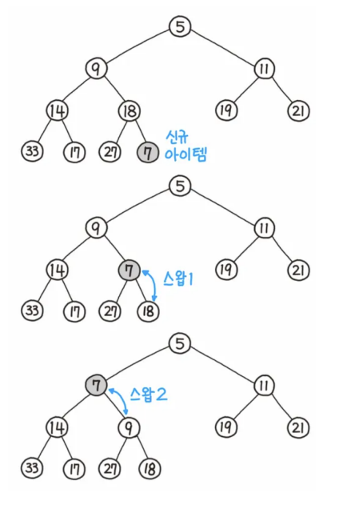
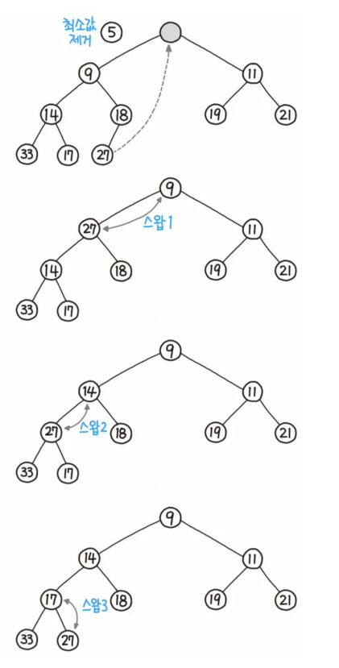

# 힙 (heap)

> 힙 (Heap tree 또는 heap)는 여러개의 값 중에서 가장 크거나 작은 값을 빠르게 찾기 위해 만든 완전 이진 트리(왼쪽에서부터 가득 채워지는 트리)

- 가장 작은 요소가 루트 노드에 있는 최소 힙, 가장 큰 요소가 루트 노드에 있는 최대힙이 존재

### 1. 힙의 종류

- 최대힙(max heap): 부모노드의 값은 자식 노드의 값보다 항상 큰 규칙을 지키는 힙. 이를 통해 요소 중 가장 큰 값을 O(1)만에 찾을 수 있음

- 최소힙(min heap): 부모노드의 값은 자식 노드의 값보다 항상 작은 규칙을 지키는 힙. 이를 통해 요소 중 가장 작은 값을 O(1)만에 찾을 수 있음

### 2. 힙의 데이터 삽입

1. 리프노드에 삽입할 노드를 삽입한다
2. 해당 노드와 부모노드를 서로 비교한다
3. 규칙에 맞으면 그대로 두고, 그렇지 않으면 부모 노드와 교환한다 (규칙 : 최대힙|최소힙)
4. 규칙에 맞을 때까지 3번 과정을 반복한다

#### 최소힙의 삽입 과정

### 3. 힙의 데이터 삭제

> 루트노드만을 제거할 수 있으며, 다음과 같은 과정이 일어난다

1. 루트 노드를 제거
2. 루트 자리에 가장 마지막 노드를 삽입한다
3. 올라간 노드와 그의 자식 노드를 비교한다
4. 규칙을 만족하면 그대로 두고, 그렇지 않으면 자식 노드와 교환한다

#### 최소힙의 삭제 과정

### 4. 이진탐색트리와의 차이점

> 이진 탐색 트리는 탐색을 쉽게 하기 위해 왼쪽이 더 작고 오른쪽이 더 큰 값으로 꼭 구성이 되어야 하지만 힙은 그렇지 않음
> 또한 최소힙을 기반으로 설명하자면 이진 탐색 트리는 왼쪽 자식 노드가 부모노드보다 더 작은 값을 가지는데, 최소힙은 그렇지 않음

### 5. 힙의 시간복잡도

- 참조(최대 혹은 최소값을 참조): O(1)
- 탐색: O(n), 모든 노드들을 탐색해야 함
- 삽입/삭제 O(logn), 트리의 높이가 logN이므로
