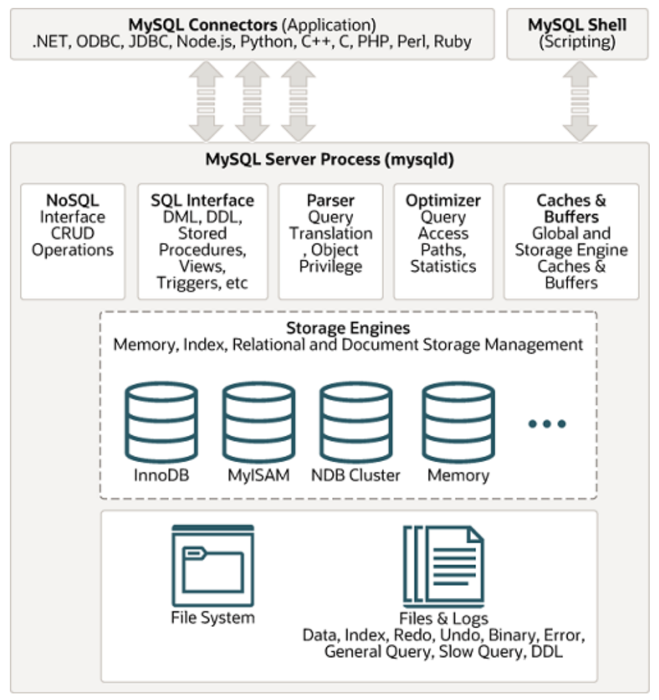

# 추상화

> 프로그래밍에서의 추상화는 복잡한 데이터, 구조, 시스템등으로부터 핵심만을 가려내 덜 자세하게 만드는 것 또는 세부사항, 절차 등을 감추고 인터페이스 등을 만드는 것으로 복잡도를 낮추는 방법. 추상화는 데이터 추상화와 프로세스 추상화 2가지로 구분

### 1. 데이터 추상화

어떠한 데이터들의 공통점을 모으고, 차이점은 버림. 예를 들어 고양이, 강아지, 원숭이 등의 객체들의 공통적인 특징을 묶어 동물이라는 카테고리로 카테고리화

- Main.java 참조

### 2. 프로세스 추상화

어떤 내부 프로세스를 숨기는 것 예를 들어, 데이터베이스가 어떻게 데이터를 저장하는지는 모르지만(내부 복잡한 로직은 모름) 단순하게 insert, upsert 등의 쿼리로 데이터를 저장할 수 있음

ex) MySQL 아키텍처

- 데이터베이스 내의 내부 프로세스와는 상관 없이 "쿼리"를 통해 접근할 수 있음
  
