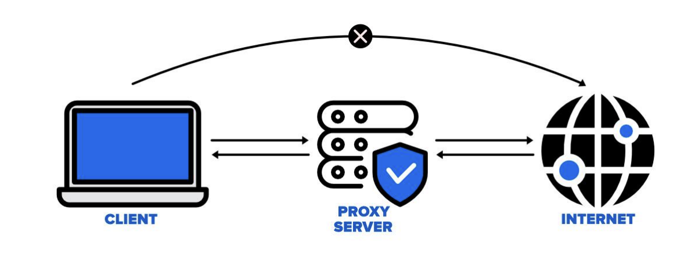
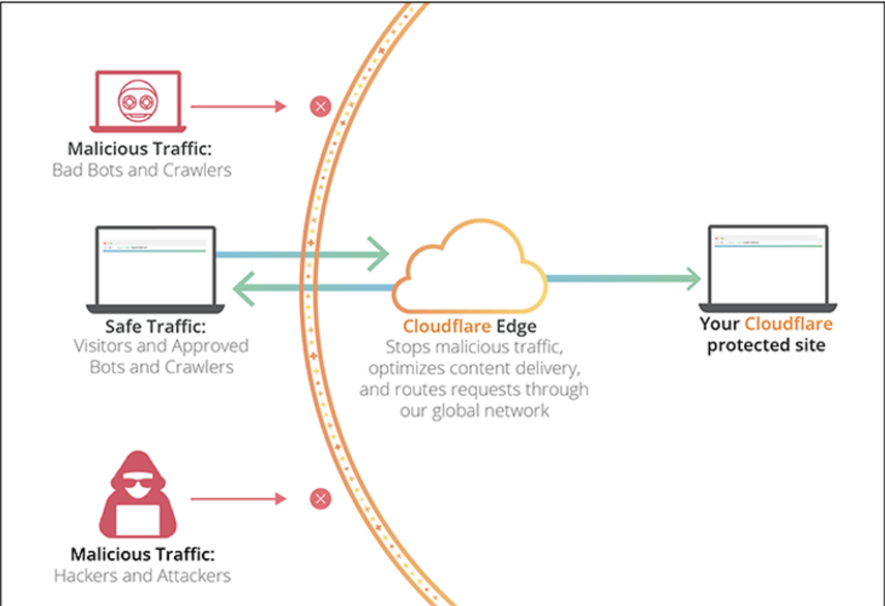

# 프록시 패턴

> 객체가 어떤 대상 객체에 접근하기 전, 그 접근에 대한 흐름을 '가로채서' 해당 접근을 필터링하거나 수정하는 등의 역할을 하는 계층이 있는 디자인 패턴

ex) 프록시 서버

- 서버 앞단에 두어 캐싱, 로깅 등에 활용
  

ex) 형규가 솔로 -> 커플로 변경이 될 때 proxy라는 중간 계층을 중간에 두어 변경 사항을 출력해주는 코드

```js
function createReactiveObject(target, callback) {
  const proxy = new Proxy(target, {
    set(obj, prop, value) {
      if (value !== obj[prop]) {
        const prev = obj[prop];
        obj[prop] = value;
        obj["changed"] = true;
        callback(`${prop}가 [${prev}] >> [${value}] 로 변경되었습니다`);
      }
      return true;
    },
  });
  return proxy;
}
const a = {
  형규: "솔로",
};
const b = createReactiveObject(a, console.log);
b.형규 = "솔로";
b.형규 = "커플";
// 형규가 [솔로] >> [커플] 로 변경되었습니다
```

- 보콩 클라이언트와 서버 사이에 프록시서버를 둔다
- 디도스 공격이나 공격적인 트래픽을 방지하기 위해 서비스 앞단에 프록시 서버로 cloudflare(클라우드 플레어)을 둬서 불필요한, 또는 공격적인 트래픽을 막음. filtering을 해줌


