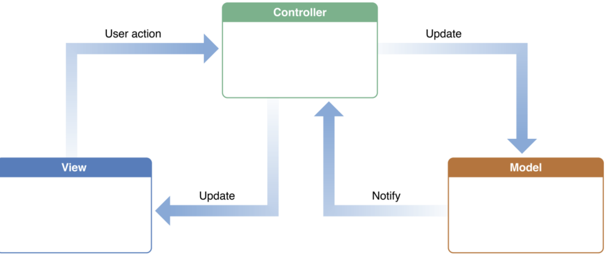
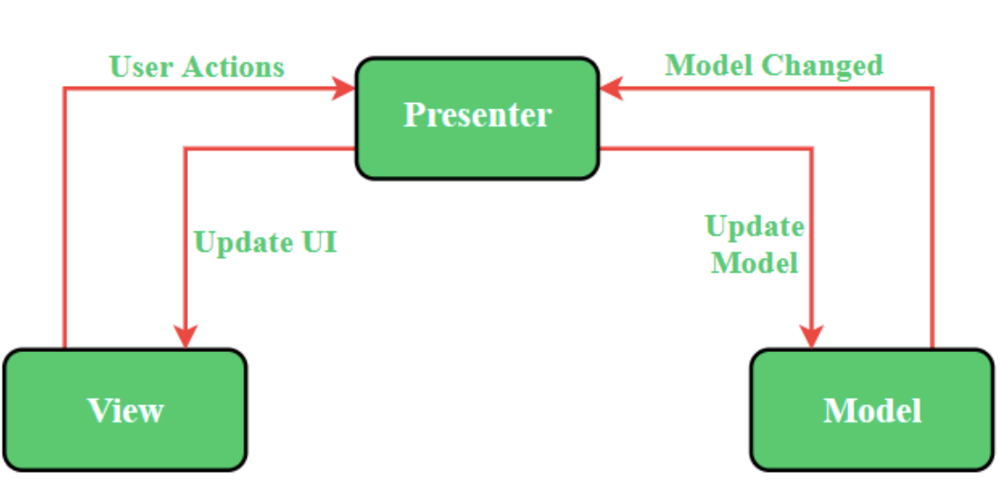
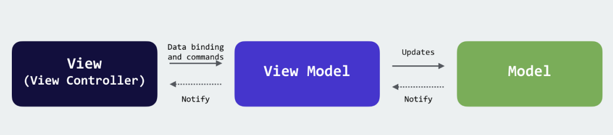

# MVC 패턴, MVP 패턴, MVVM 패턴

### 1. MVC 패턴

> 모델(Model) 뷰(View) 컨트롤러(Controller)로 이루어진 디자인 패턴

#### 모델

- 애플리케이션의 데이터인 데이터베이스, 상수 변수 등을 뜻함
  뷰에서 데이터를 생성하거나 수정할 때, 컨트롤러를 통해 모델이 생성 혹은 업데이트 된다
  ex) 사용자가 네모 박스에 글자를 적을 때, 모델은 네모박스의 크기 정보, 글자 내용, 글자의 위치, 글자의 포맷 정보/ 사용자가 글을 적을 수 있는 텍스트 박스는 view에 해당

#### 뷰

- UI
- inputbox, checkbox, textarea등 사용자 인터페이스 요소를 나타내며, 모델을 기반으로 사용자가 볼 수 있는 화면
- 모델이 가지고 있는 정보를 따로 저장하지 않아야 하며 변경이 일어나면 이를 컨트롤러에 전달

#### 컨트롤러

- 하나 이상의 모델과 하나 이상의 뷰를 잇는 다리 역할
- 이벤트의 메인 로직을 담당
- 모델과 뷰의 생명 주기 관리
- 모델이나 뷰의 변경 통지를 받으면 이를 해석하여 각각의 구성 요소에 해당 내용에 대해 알려줌

#### MVC 패턴의 장점

- 애플리케이션의 구성 요소를 세 가지 역할로 구분하여 개발 프로세스에서 각각의 구성 요소에만 집중하여 개발할 수 있음
- 재사용성과 확장성이 용이

#### MVC 패턴의 단점

- 애플리케이션이 복잡해질수록 모델과 뷰의 관계가 복잡해지는 단점

#### MVC 패턴의 예시

- MVC 패턴을 반영한 대표적인 프레임워크로 Spring Web MVC가 있음

### 2. MVP 패턴

> C가 P (프레젠터, presenter)로 교체된 패턴. V와 P는 1:1관계이므로 MVC보다 조금 더 강한 결합을 지닌 디자인 패턴

> 

### 3. MVVM 패턴

> MVC의 C가 VM (뷰 모델)로 바뀐 패턴. VM은 뷰를 추상화한 계층이며, VM: V = 1: N 이라는 관계를 가짐

- 여기서 VM(뷰 모델)은 커멘드와 데이터바인딩을 가짐
  - 커맨드: 여러 요소에 대한 처리를 하나의 액션으로 처리할 수있는 기법
  - 데이터 바인딩: 화면에 보이는 데이터와 브라우저 상의 메모리 데이터를 일치시키는 방법

#### MVVM 대표 프레임워크

- Vue.js

### 4. 차이점 정리

|      | MVC 패턴               | MVP 패턴                          | MVVM 패턴             |
| ---- | ---------------------- | --------------------------------- | --------------------- |
| 관계 | 컨트롤러와 뷰는 1 : N  | 프레젠터와 뷰는 1 : 1 (강한 결합) | 뷰 모델과 뷰는 1: N   |
| 참조 | 뷰는 컨트롤러를 참조 x | 뷰는 프레젠터를 참조 o            | 뷰는 뷰 모델을 참조 o |
