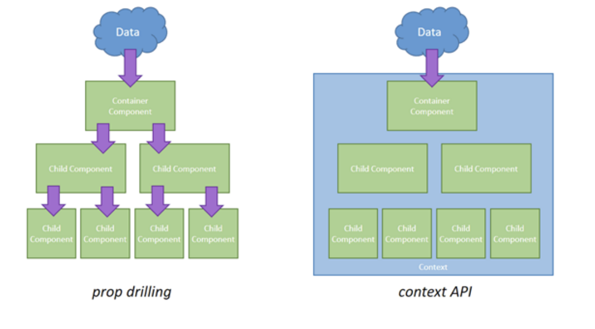

# 컨텍스트

- 컨텍스트는 2가지 뜻으로 쓰임

1. 어떤 종류의 상태, 환경을 캡슐화한 것
2. 작업이 중단되고 나중에 같은 지점에서 계속될 수 있도록 저장하는 최소 데이터 집합
   ex) 컨텍스트스위칭

- 컨텍스트는 contextt와 contextual information으로 나누어짐

1. 병원에 가면 이름과 주민등록번호 앞자리를 말해야 함. 여기서 병원에 방문하는 context에서 이름은 contextual information이 된다
2. Http 요청을 하는 context에서 http header는 contextual information

- context를 기반으로 한 모듈 혹은 API로는 react.js에서 전역적 static contexttype을 사용해서 상태 값을 넘길 수 있는 context API가 존재
  
