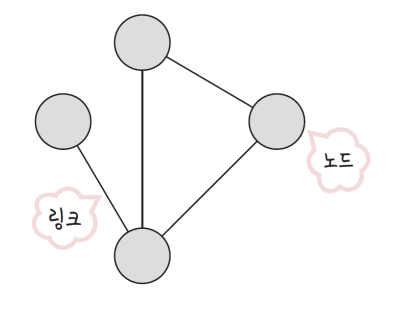
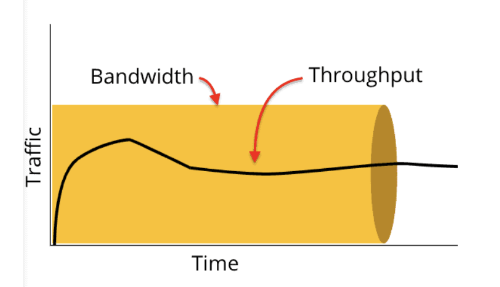
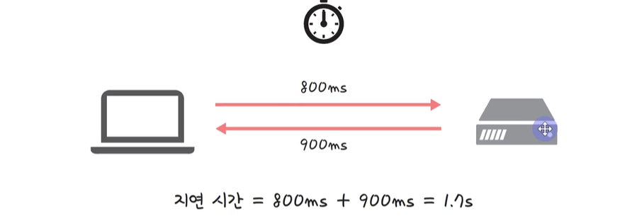
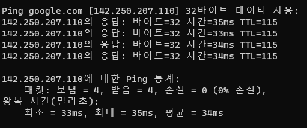

# 네트워크의 기초 - 네트워크, 처리량, 트래픽, 대역폭, RTT

### 1. 네트워크

> 네트워크란? 노드(node)와 링크(link)가 서로 연결되어 있으며, 리소스를 공유하는 집합

| 노드       | 서버, 라우터, 스위치 등 네트워크 장치           |
| ---------- | ----------------------------------------------- |
| 링크(엣지) | 유선 또는 무선과 같은 연결매체 (와이파이나 LAN) |



ex) 네이버 웹툰을 본다

핸드폰 = Node (lan 카드 보유)
네이버 서버 = Node

와이파이 사용해서 연결 = Link (장치와 장치간의 연결 역할)

### 2. 트래픽

> 트래픽이란? 특정 시점에 링크 내에 "흐르는" 데이터의 양

- 예시 > 서버에 저장된 파일(문서, 이미지, 동영상 등)을 클라이언트(사용자)가 다운로드 시 발생되는 데이터의 누적량

- 단위 : `bps` (bits per seconds)



\*cf 트래픽 VS 처리량

- 트래픽이 많아졌다 = 흐르는 데이터가 많아졌다
- 처리량(throughput)이 많아졌다 = 처리되는 트래픽이 많아졌다

이미지나 동영상 요청 시 서버에는 다음과 같은 트래픽 발생

- Q1: 100KB 이미지를 1000 명이 다운로드 시 누적 트래픽?
  100KB \* 1000 = 100,000KB = 100MB
- Q2: 10MB 동영상을 10명이 다운로드 시 누적 트래픽?
  10MB \* 10 = 100MB

### 3. 처리량

> 처리량(throughput)은 링크 내에서 성공적으로 전달된 데이터의 양을 말하며 보통 얼만큼의 트래픽을 처리했는지를 나타냄

- 많은 트래픽을 처리한다 = 많은 처리량을 가진다
- 단위 : `bps`(bits per seconds) 초당 전송 또는 수신되는 비트 수, 트래픽과 단위 동일

- 처리량은 사용자들이 많이 접속할 때마다 커지는 트래픽, 네트워크 장치 간의 대역폭, 네트워크 중간에 발생하는 에러, 장치의 하드웨어 스펙에 영향을 받음
  - 갑자기 사용자가 급증하여 트래픽이 늘어나면 서버 다운되어 처리량 감소
  - 대역폭이 좁으면 처리량 감소

### 4. 대역폭

> = bandwidth. 주어진 시간 동안 네트워크 연결을 통해 흐를 수 있는 최대 비트 수. 최대로 처리할 수 있는 트래픽

- 고속도로의 차선이 2차선일 때보다 8차선일 때 더욱 원활하게 교통이 이루어지듯이, 대역폭이 높을수록 사용자들에게 빠른 서비스 제공 가능
- 대략적인 **최대동시접속자수**를 유추하는 척도가 됨

- 단위 `bps` (bits per seconds) 초당 전송 또는 수신되는 비트 수


Q: 100Mbps라는 대역폭을 가진 서버가 있고 한 사용자당 100kbps로 동영상 파일을 요청한다고 해보자. 최대 동시 접속자 수?
100Mbps / 100kbps = 1000 명

### 5. RTT

> Round Trip Time: 왕복 지연시간 은 신호를 전송하고 해당 신호의 수신 확인에 걸린 시간을 더한 값 = 어떤 메시지가 두 장치 사이를 왕복하는데 걸린 시간



```cmd
ping google.com
```



- 여기서 왕복 시간이 바로 RTT
