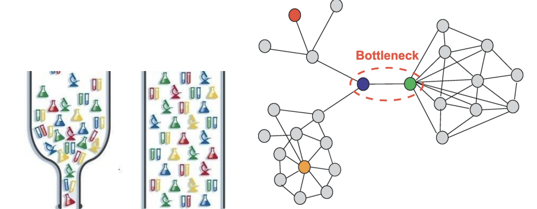

# 네트워크의 기초 - 네트워크 토폴로지의 필요성과 병목현상

### 1. 네트워크 토폴로지의 필요성

- **병목 현상을 해결하는 척도**가 된다
- 노드와 링크의 구성 방식에 따라서 병목 현상이 발생할 수도, 안 할수도 있다

### 2. 병목현상(bottleneck)

- 병목현상은 트래픽에 의해 데이터 흐름이 제한되는 상황을 말함 핫스팟이라고도 한다 (네트워크 한정)
  

### 3. 네트워크 토폴로지를 이용한 병목 현상의 해결 사례

#### 분산 웹 인프라 구조 - Distributed Web Infrastructure

- 트래픽이 많아지면 => 서버 다운

  - 자원(메모리)늘리는 식으로 해결할 수도 있지만, 회선의 수를 늘려서 병목 현상을 없애 서버 다운 현상을 해결하는 척도가 된다

- 구축된 시스템의 토폴로지를 알고 있다면, 어떠한 부분에 어떠한 회선 또는 어떤 서버의 용량을 증가시켜야 하는지 앓 수 있다
