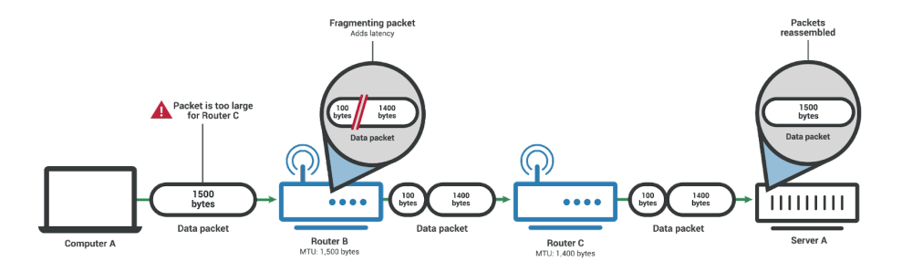
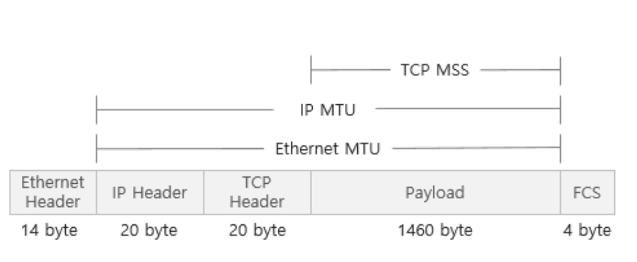

# TCP/IP 4계층 - MTU와 MSS와 PMTUD

### 1. MTU

> MTU = Maximum Transmission Unit

- 네트워크 통신 할 때 가능한 가장 큰 PDU의 크기 (cf 터널의 높이 제한을 생각)
- 네트워크에 연결된 장치가 받아들일 수 있는 최대 데이터패킷의 크기. 이 크기를 기준으로 데이터가 쪼개져서 패킷화된다.
- 즉, 패킷이 쪼개질 때 MTU 를 기반으로 쪼개진다.
- 네트워크 경로 상에 있는 아무 장치의 MTU보다 패킷이 크면 그 패킷은 분할될 수도 있다
- 통신을 하는 양쪽 끝은 각 장치의 MTU 뿐만 아니라 중간의 모든 라우터, 스위치, 서버를 고려해야 한다.

- Router C의 MTU가 1400바이트기 때문에 패킷이 분할되는 모습
  

### 2. 패킷이 분할되지 않는 경우

> 네트워크 경로 상에 있는 어떠한 라우터나 장치의 MTU 초과 시 패킷을 분할하는 대신 패킷을 아예 전달하지 않을 수도 있다

#### IP6

- 아예 분할을 하지 않음

#### IP4

- 헤더에 flags라는 필드가 있는데 여기서 bit가 1이 되면 'don't fragment' 플래그가 활성화되면서 이 경우 패킷 분할이 불가능하다

### 3. MTU와 MSS

> MTU는 IP헤더와 TCP 헤더의 크기까지 합치지만 MSS(Maximum Segent Size)는 데이터의 크기 (payload의 크기)만을 가리킴



- 일반적으로 MTU는 1500 바이트이며 MSS는 1460바이트이다. 따라서 네트워크를 통해 데이터를 보낼 때 MTU가 1500이더라도 데이터는 보통 1460바이트 이하의 크기로 보내야 전달이 된다
- 그림에서 이더넷 헤더와 FCS (Frame Check Sequence)를 포함한 것을 이더넷 프레임이라고 하고 FCS는 데이터의 에러 검출을 돕기 위해 삽입되는 필드로 CRC에 의해 생성되는 값
  - 이더넷 프레임의 크기는 일반적으로 1518바이트

cf) 내 장치의 MTU 확인?

```cmd
netsh interface ipv4 show interfaces
```

#### 4. PMTUD

> Path MTU Discovery

- 수신자와 송신자의 경로 상에서 장치가 패킷을 누락한 경우 테스트 패킷의 크기를 낮추면서 MTU에 맞게끔 반복해서 보내는 과정
