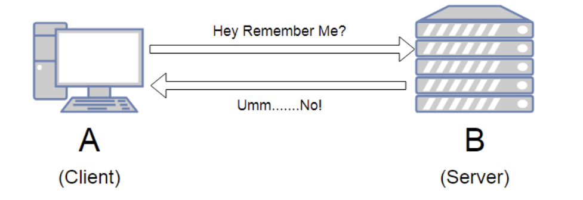

# TCP/IP 4계층 - 애플리케이션 (Application) 계층

> HTTP, SMTP, SSH, FTP가 대표적이며 웹 서비스, 이메일 등 서비스를 실질적으로 사람들에게 제공하는 층

### 1. HTTP

> Hypertext Transfer Protocol

- 서버와 브라우저 간에 데이터를 주고 받기 위해 설계된 프로토콜
- 브라우저 뿐만 아니라 서버와 서버 간의 통신 시에도 많이 사용
  - ex) web scarping
  - ex) MSA 서버와 서버 간의 통신

#### HTTP는 헤더를 통한 확장이 쉽다

- HTTP 요청 시 다른 값을 추가하고 싶으면 새로운 header에다가 데이터를 넣어서 보내면 된다

#### HTTP는 stateless 하다

- 동일한 연결에서 연속적으로 수행되는 두 요청 사이에 연속적인 상태(state)값은 없다
  - 서버 입장에서는 동일한 client가 요청을 또 보내는 건지, 아닌지 알 수 없다. 상태를 저장하지 않기 때문



### 2. SSH

> Secure SHhell Protocol

- 보안되지 않은 네트워크에서 네트워크 서비스를 안전하게 운영하기 위한 암호화 네트워크 프로토콜
- 나의 로컬 pc로부터 원격지에 코드, 데이터, 파일 등을 올릴 때 사용

```
ssh <pem> <user>@<serverIp>
```

또한 scp를 사용해 파일을 전송해서 사용할 수 있음

### 3. FTP

> File Transfer Protocol

- 노드와 노드 간의 파일을 전송하는데 사용되는 프로토콜
- 파일을 암호화하여 전송하는 FTPS 또는 SFTP로 대체되고 있음

### 4. SMTP

> Simple Mail Transfer Protocol

- 인터넷을 통해 메일을 보낼 때 사용되는 프로토콜
- 보통 서비스를 운영하면 메일링 서비스를 하게 되는데, node.js를 통해 메일을 보낸다면 NodeMailer 라이브러리를 사용해야 하고 이는 JS를 기반으로 SMTP를 통해 메일을 보낼 수 있는 라이브러리이다.
