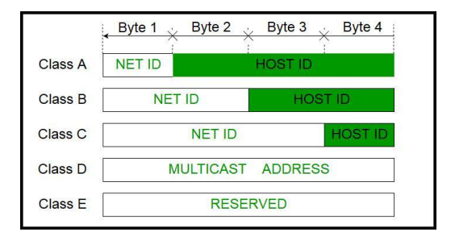
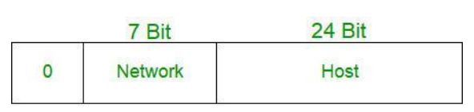
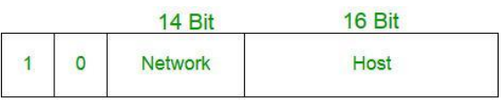
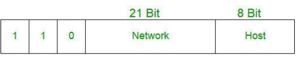
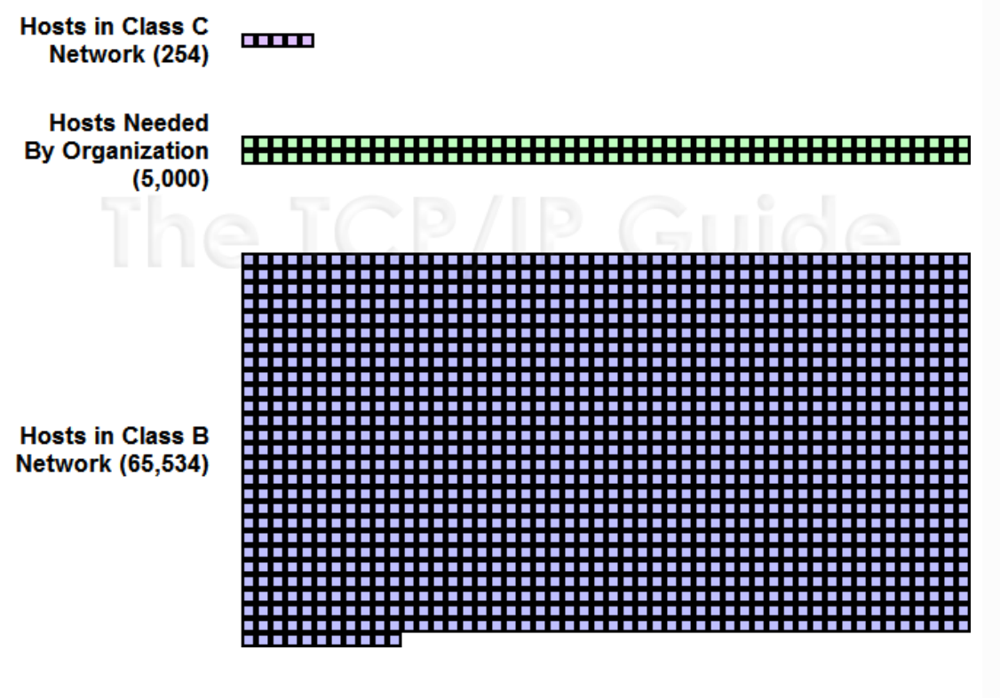

# IP 주소체계 - 클래스풀 (Classful IP Addressing)

> IP주소 = 인터넷 주소. 네트워크 주소, 호스트 주소 2 부분으로 나누어짐

- 네트워크 주소는 호스트들을 모은 네트워크를 지칭
- 하나의 네트워크 안에 호스트 여러 개 존재

  - A회사의 네트워크에 속한 컴퓨터로 B 회사의 네트워크에 속한 컴퓨터에 접속할 수 없도록 막아야 한다

- 네트워크 주소가 동일 = 로컬 네트워크
- 호스트 주소 = 호스트를 구분하기 위한 주소
- 네트워크 호스트 = 컴퓨터 네트워크에 연결된 컴퓨터나 기타 장치

### 1. Classful IP 정의

- 기준 :IPv4

> 네트워크 주소를 매기고 그에 따라 네트워크의 크기를 다르게 구분하여 클래스를 할당하는 주소 체계. 구분하는 기준자 (1, 2, 3 옥텟)을 `서브넷마스크` 라고 함

#### 클래스 A

- 첫 옥텟이 네트워크 주소, 나머지 3개의 옥텟은 호스트 주소
  

- 한 네트워크 당 2^24 - 2 개의 호스트 ID (약 1600만개)
- 네트워크 주소 범위 : 1 ~ 126 으로 시작
  - 원래는 127.255.255.255까지 포함하지만 127.X는 루프백 주소이기 때문에 포함 x
  - 0.0.0.0 도 특수주소로 포함 x(알 수 없는 대상에 달아 놓는 임시 주소)

> 루프백 주소
> 127.0.0.1 또는 localhost로 접속. 본인 네트워크를 지칭하는 특수 주소

#### 클래스 B

- 2^16 - 2 = 한 네트워크 당 65534개 호스트 ID
- 네트워크 주소 범위: 128~191로 시작

#### 클래스 C

- 2^8 -2 = 한 네트워크 당 254개 호스트 ID
- 네트워크 주소 범위: 192 ~ 223으로 시작

#### 호스트 ID개수 구할 때 2 빼는 이유

- 맨 앞자리는 `네트워크 주소`로 남겨두며 마지막 주소는 `브로드캐스팅 주소`로 남겨놓음 (2개 마이너스)
  ex) 클래스 C 192.0.0.0 = 네트워크 주소 (외부 네트워크와 통신할 때 주소)

#### 클래스풀의 문제점은 무엇인가요?

- 네트워크의 크기가 작은 경우, 큰 네트워크를 필요로 하는 조직은 여러 개를 확보해야 하는 어려움이 생긴다
- 또한 작은 네트워크가 필요한 조직의 경우 너무 많은 IP 를 가져가므로 IP가 낭비되는 문제가 존재

  
