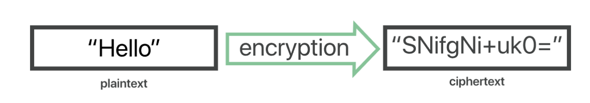

# HTTPS 와 TLS - 암호화

> HTTPS = HTTP + TLS => 암호화된 통신 가능

### 1. 암호화란?

- 승인된 당사자만 정보를 이해할 수 있도록 데이터를 "스크램블"한 방법
- 이를 복호화하려면 송신자와 수신자가 서로 동의한 "key"가 필요

  - 또는 암호화된 cyphertext를 만들기 위해 키가 쓰이기도 한다
  - cyphertext = plaintext + key

    

### 2. 스크램블

- 단어나 문자를 패턴에 따라 암호화하는 것이 아니라 `무작위` 방식으로 개별 데이터 비트를 섞는 것

- 예를 들어, 공통 128비트 고급 암호화 표준 (Advanced Encryption Standard, AES)로 암호화된 파일의 경우, 이 파일을 구성하는 비트는 약 10회 스크램블되며, 다른 컴퓨터가 키 없이 해독하려면 아주 오랜 시간이 걸린다. 비트가 높아질 수록 스크램블을 더 많이 하게 되고 더 복잡해지는 것인데 이 128비트는 AES의 가장 약한 버전. 192비트 및 256 비트 키(key) 크기도 제공된다

### 3. 키(key)를 기반하여 암호화 하는 방법

> 대칭 암호화, 비대칭 암호화

#### 대칭 암호화

- 키를 하나만 사용하는 암호화 방법 (암호화 할 때와 복호화할 때 동일한 키를 사용하는 경우)
- 일반적으로 사용되는 대칭 암호화 알고리즘: DES, AES

#### 비대칭 암호화

- = 공개 키 암호화
- 두 개의 다른 키 (공개키, 개인키)로 데이터를 암호화하거나 서명하고 키 중 하나인 공개키를 누구나 사용할 수 있도록 하는 방법
- 공개키로 암호화된 데이터는 개인키로만 복호화할 수 있음
- 일반적으로 사용되는 비대칭 암호화 알고리즘: RSA, DH(Diffie-Hellman)

#### TLS는? 부분적인 비대칭 암호화 + 대칭 암호화 (TLS 1.3 ver)

- 비대칭 암호화로 인증을 한 뒤, 대칭 암호화로 보안적 통신을 시작
- TLS 핸드셰이크 과정에서 처음 인증 할 때 비대칭 암호화를 하고, 그 이후 클라이언트와 "세션키"라고 하는 키를 기반으로 대칭 암호화를 기반으로 한 암호화된 통신 진행

#### 암호화의 필요성

- 의도된 수신자 또는 송신자를 제외하고는 통신을 하이재킹(= 가로채기)하여 읽을 수 없게 한다
  -> 이를 통해 민감한 데이터의 유출을 방지하고 데이터 무결성(= 데이터의 정확성과 일관성)을 보장
