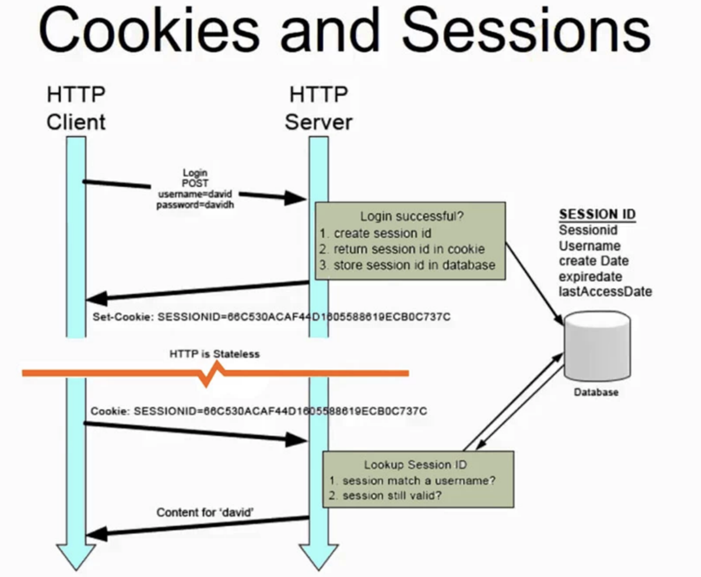

# 로그인 - 세션 기반 인증 방식

- HTTP의 특징 중 하나는 상태없음(stateless)하다
- 즉, HTTP 요청을 통해 데이터를 주고받을 때 요청이 끝나면 요청한 사용자의 정보 등을 유지하지 않는 특징이 있음

- 그렇기 때문에 로그인 상태를 어떻게 유지하느냐?에 대한 질문이 생김.

### 1. 용어 정리

- 세션: 서버와 클라이언트의 연결이 활성화된 상태
- 세션ID : 웹 서버 또는 DB에 저장되는 클라이언트에 대한 유니크한 ID

### 2. 세션 기반 로그인 프로세스

- 처음 로그인 >> 세션 ID가 생성 >> 서버에서 세션 ID를 쿠키로 설정해서 클라이언트에 전달
- 클라이언트가 서버에 요청을 보낼 때 요청 헤더에 해당 세션 ID를 쿠키로 답아서 전에 로그인했던 아이디인지 확인
- 로그인이 유지

  

### 3. 세션 기반 로그인의 단점

- 사용자의 상태에 대한 데이터를 서버에 저장했을 때, 로그인 중인 유저의 수가 늘어난다면 서버의 메모리 과부하가 일어날 수 있다
- DB중 RDBMS에 저장한다면 직렬화 및 역직렬화에 관한 오버헤드(cost, 비용)가 발생

#### 미들웨어란?

- 공통 서비스 및 기능을 애플리케이션에 제공
- 우리 서비스의 모든 url 요청에 대해서 공통적인 로그인 미들웨어를 둘 수 있음
  -> /api /product /category..
