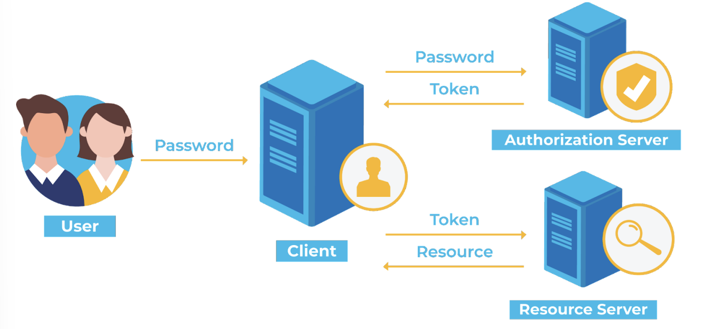
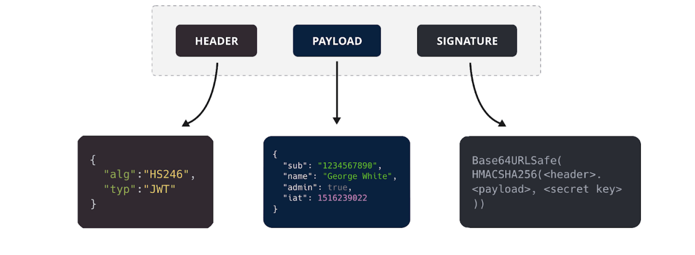
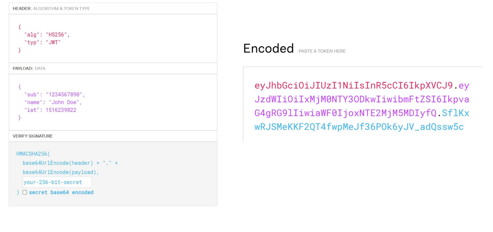
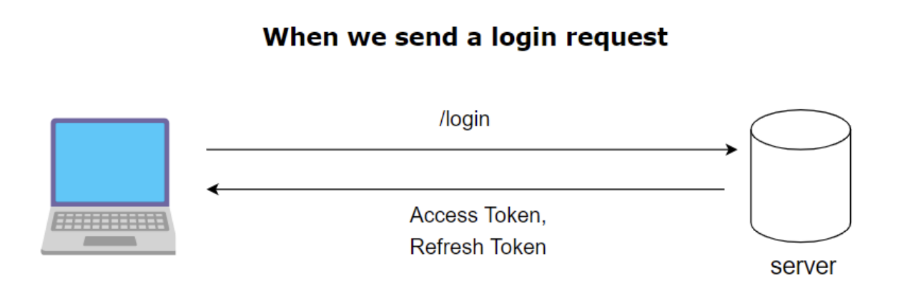
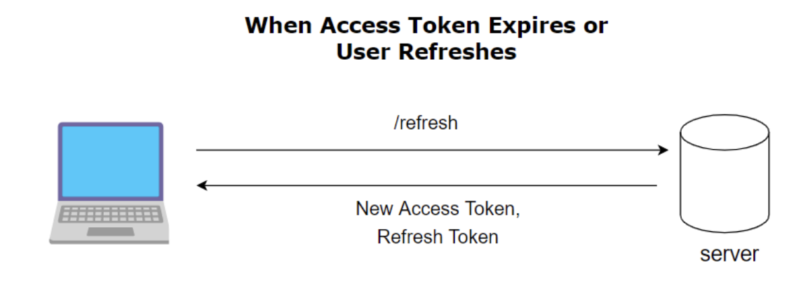

# 로그인 - 토큰 기반 인증 방식 (access토큰, refresh 토큰)

### 1. 토큰 기반 인증 방식

- state(유저의 상태)를 모두 토큰 자체만으로 처리하며 토큰을 처리하는 한 서버를 두고 다른 컨텐츠를 제공하는 서버는 모두 stateless하게 만들자는 이론이 담긴 방식

- 왜 토큰을 관리하는 서버를 별도로 따로 두어야 할까?

  - 여러 개의 서버를 운용한다고 했을 때 토큰 기반 인증 & A 도메인을 처리하는 서버로 구축할 경우 A 도메인에서 에러 발생 시 인증에 관한 기능이 마비되고, 이는 B, C, D 등의 도메인 기능이 연쇄적으로 마비될 수 있기 때문

- 토큰은 주로 `JWT 토큰`이 사용된다

1. 인증 로직 >> JWT 토큰 생성 (access 토큰, refresh 토큰)
2. 사용자가 이후에 access 토큰을 HTTP header - Authorization 또는 HTTP header - Cookie에 담아 인증이 필요한 서버에 요청해 원하는 컨텐츠를 가져옴

### 2. JWT란?

> JWT = Json Web Token -헤더, 페이로드, 서명으로 이루어져 있으며 JSOn 객체로 인코딩되며 메시지 인증, 암호화에 사용된다

#### Header

- 토큰 유형과 서명 알고리즘, base64URI로 인코딩된다

#### Payload

- **데이터**(ex user id, pw), 토큰 발급자, 토큰 유효기간, base64URI로 인코딩된다

#### Signature

- (인코딩된 header + payload) + 비밀키를 기반으로 헤더에 명시된 알고리즘으로 다시 생성한 서명값

### 3. JWT 토큰의 장점

- 사용자 인증에 필요한 모든 정보를 토큰 자체에 포함하기 때문에 별도의 인증 저장소가 필요 없음 (세션 같은 경우 세션 ID를 서버 또는 db에 저장해야만 함)
- 다른 유형의 토큰과 비교했을 때 경량화되어 있음 (SAML, Security Assertion Markup Language Tokens라는 토큰에 비해 가벼움)
- 디코딩했을 때 JSON이 나오기 때문에 JSON을 기반으로 쉽게 직렬화, 역직렬화가 가능

### 4. JWT 토큰의 단점

- 토큰을 탈취당할 경우, 디코딩했을 때 데이터를 볼 수 있음
  -> refresh 토큰과 access 토큰 두 종류를 사용함으로써 해당 문제 어느정도 해결
- 토큰이 비대해질 경우, 서버 과부하에 영향을 줄 수 있음

### 5. refresh 토큰과 access 토큰

- 수명: access 토큰 << refresh 토큰
- refresh 토큰은 access 토큰이 만료되었을 때 다시 access 토큰을 얻기 위해 사용되는 토큰
- access 토큰 기한이 작아야 해커의 탈취 가능성이 줄어들 수 있음
- authorization 헤더에 넣는 토큰은 access 토큰

### 6. 주의할 점

> access 토큰을 얻고 요청 시에는 http header Authorization 또는 http header Cookie에 담아 요청을 해야 하는데 이 때 지켜야할 규칙들이 존재

- `Bearer ` 를 token 앞에 붙여서 토큰 기반 인증방식이라는 것을 알려주어야 한다
- https 를 사용해야 한다
- 쿠키에 저장한다면 sameSite: 'Strict'를 사용해야 한다
- 수명이 짧은 access token을 발급해야 한다
- url에 토큰을 전달하지 말아야 한다
