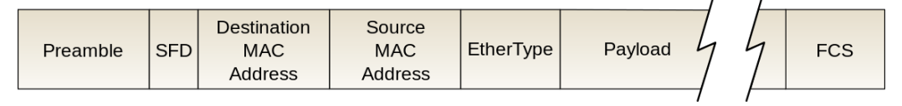

# 이더넷 프레임의 정의, 구조

### 정의

> 데이터 링크 계층의 데이터 단위. 이더넷 프레임을 기반으로 데이터가 전달된다

- 구성
  

  - preamble[7바이트]: 이더넷 프레임이 시작됨을 알려줌
  - SFD[1바이트]: Start Frame Delimeter, 다음 필드부터 주소 필드가 시작됨을 알려줌
  - Address[6바이트,6바이트]: 목적지 주소, 시작지 주소
  - EtherType[2바이트]: 데이터링크 계층 위의 IP 프로토콜을 정의 (IPv4, IPv6)
  - Payload[가변바이트]:데이터 또는 페이로드. 가변길이 필드. 해당 필드는 이진데이터(0과 1로 이루어진 데이터)로 구성됨. IEEE 표준은 최대 페이로드를 1500바이트로 지정
  - FCS[4바이트]: Frame Check Sequence, 수신 측의 에러 검출을 위해 삽입하는 필드. CRC 에러 검출 기법에 의해 생성된 비트배열이 여기 담김. 비트 배열을 기반으로 수신된 데이터가 손상되었는지를확인하고, 에러 확인시에는 해당 프레임을 폐기하고 송신측에 재전송을 요구하기 위한 필드
