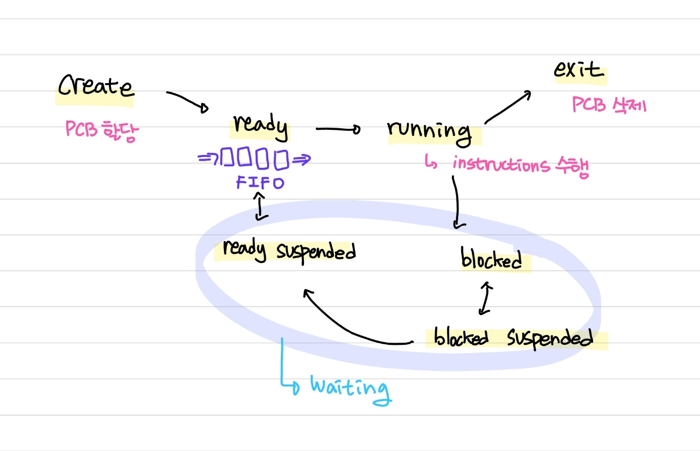

# 프로세스의 상태

### 생성 상태

> create or new

- 프로세스가 생성된 상태를 의미하며, `fork()` 또는 `exec()`함수를 통해 프로세스가 생성된 상태. 이때 PCB가 할당된다

#### fork()

- 부모 프로세스의 주소 공간을 그대로 복사하며, 새로운 자식 프로세스를 생성하는 함수. 주소 공간만 복사할 뿐이지, 부모 프로세스의 비동기 작업 등을 상속하지는 않음

#### exec()

- 새롭게 프로세스를 생성

### 대기 상태

> ready

- 처음 프로세스가 생성된 이후, 메모리 공간이 충분하면 메모리를 할당받고, 아니면 아닌 상태로 준비 큐(준비 순서열)에 들어가서 대기중인 상태
- CPU 스케쥴러로부터 CPU 소유권이 넘어오기를 기다리는 상태

### 대기 중단 상태

> ready suspended

- 준비 큐가 꽉 찬 상태 즉, 메모리 부족으로 일시 중단된 상태

### 실행 상태

> running

- CPU 소유권과 메모리를 할당받고 instrucion을 수행 중인 상태. 이를 CPU burst가 일어났다라고도 표현

### 중단 상태

> blocked

- 어떤 이벤트가 발생한 이후 기다리며 프로세스가 차단된 상태
- 예를 들어 프린트 인쇄 버튼을 눌렀을 때, 실행하고 있던 프로세스가 잠깐 멈춘듯할 때가 있는데 이는 프린트 인쇄에 관한 I/O 요청으로 인해 인터럽트가 발생하여 현재 실행되고 있던 프로세스가 중단 상태로 잠시 변경

### 일시 중단 상태

> blocked suspended

- 대기 중단과 유사. 중단된 상태에서 프로세스가 실행되려고 했으나, 메모리 부족으로 일시 중단된 상태

### 종료 상태

> terminated or exit

- 프로세스 실행이 완료되어 해당 프로세스에 대한 자원을 반납하며 PCB가 삭제되는 상태. 종료는 자연스럽게 종료되는 것도 있지만, 부모 프로세스가 자식 프로세스를 강제적으로 종료시켜 비자발적 종료(abort)로 종료되기도 한다
- 자식 프로세스에 할당된 자원의 한계치를 넘어가거나, 부모 프로세스가 종료되거나, 사용자가 `process.kill`등의 명령어로 프로세스를 종료시킬 때 발생
