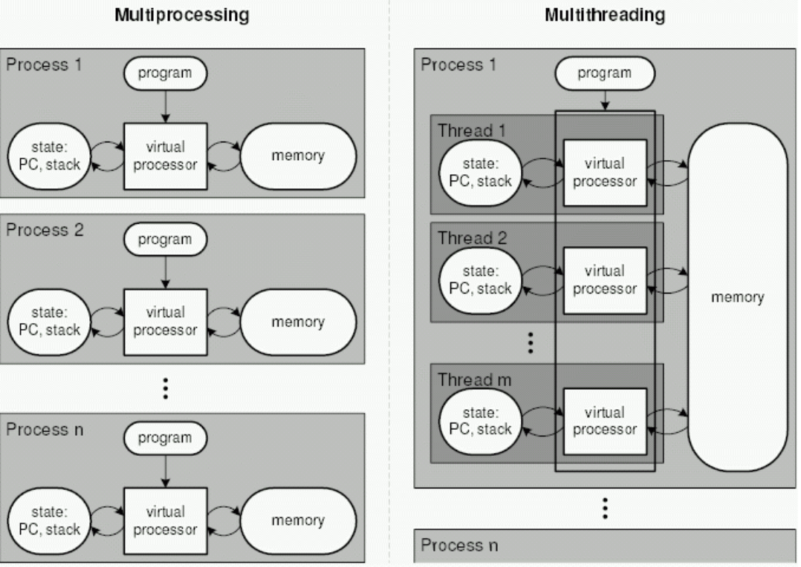

# 멀티 프로세싱과 멀티 스레딩

### 1. 멀티 프로세싱

> 여러개의 프로세스, 즉 멀티 프로세스를 통해 동시에 2가지 이상의 일을 수행

- 똑같은 일을 병렬적으로 수행 가능
- 특정 프로세스 중 일부에 문제가 생기더라도 다른 프로세스에 영향을 미치지 않으며 격리성과 신뢰성이 높은 장점 존재

### 2. 멀티 스레딩

> 프로세스 내 작업을 멀티 스레드로 처리하는 기법.

- 스레드끼리 서로 자원을 공유하고 프로세스보다는 가볍기 때문에 효율성이 높다
- 하지만 한 스레드에 문제가 생기면 다른 스레드에도 영향을 끼쳐 스레드들로 이루어져 있는 프로세스에 영향을 줄 수 있다는 단점 존재



#### 실습 > 멀티 스레딩 예시 (Java)

- 자바에서는 프로세스 간 통신 보다는, 스레드를 활용한 병렬 실행이 더 일반적

```java
import java.io.IOException;
import java.net.URI;
import java.net.http.HttpClient;
import java.net.http.HttpRequest;
import java.net.http.HttpResponse;
import java.lang.ProcessHandle;

public class MultiProcessingExample {

    public static void main(String[] args) {
        Runnable task1 = () -> processTask("프로세스 1");
        Runnable task2 = () -> processTask("프로세스 2");

        Thread thread1 = new Thread(task1);
        Thread thread2 = new Thread(task2);

        thread1.start();
        thread2.start();

        try {
            thread1.join();
            thread2.join();
        } catch (InterruptedException e) {
            e.printStackTrace();
        }
    }

    private static void processTask(String name) {
        System.out.println("pid of parent: " + ProcessHandle.current().parent().orElseThrow().pid());
        System.out.println("pid of " + name + " : " + ProcessHandle.current().pid());

        HttpClient client = HttpClient.newHttpClient();
        HttpRequest request = HttpRequest.newBuilder()
                .uri(URI.create("https://w3schools.com/python/demopage.htm"))
                .build();

        try {
            HttpResponse<String> response = client.send(request, HttpResponse.BodyHandlers.ofString());
            System.out.println(response.body());
        } catch (IOException | InterruptedException e) {
            e.printStackTrace();
        }
    }
}
```
