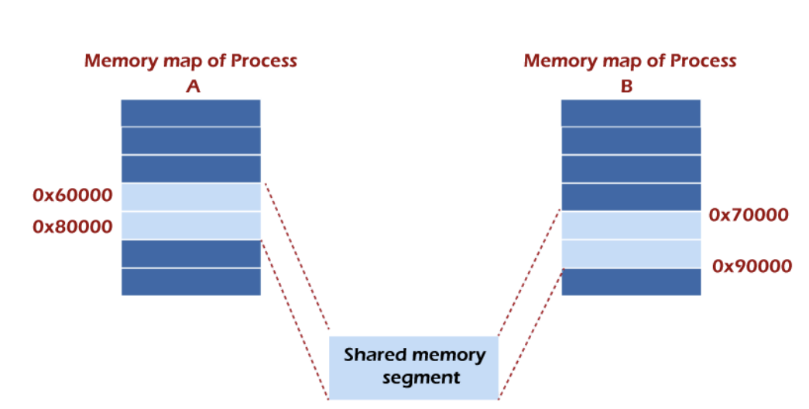
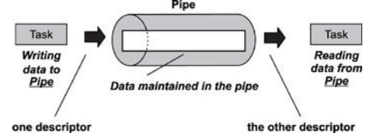
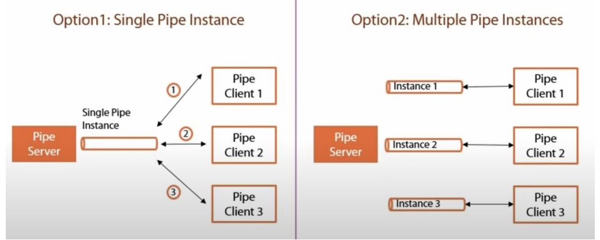
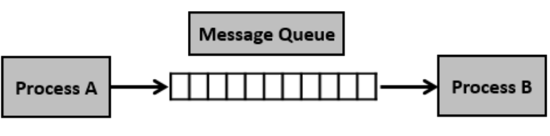

# IPC (Inter-Process Communication)

> 프로세스끼리 데이터를 주고받고, 공유 데이터를 관리하는 매커니즘

- IPC의 종류: 공유메모리, 파일, 소켓, 파이프, 메시지 큐
- 예를 들어 브라우저를 띄워서 네이버 서버와 HTTP 통신해서 html 등의 파일을 가져오는 것도 IPC

### 1. 공유 메모리

- 여러 프로세스가 서로 통신할 수 있도록 메모리를 공유하는 것
- IPC 방식 들 중, 어떤 매개체를 통해 데이터를 주고받는 것이 아니라 메모리 자체를 공유하기 때문에
  불필요한 데이터 복사의 오버헤드가 발생하지 않아 가장 빠르며, 같은 메모리 영역을 여러 프로세스가 공유하기 때문에 동기화가 필요
- IPC 중 가장 빠른 통신 방법

### 2. 파일

- 디스크에 저장된 데이터(파일)를 기반으로 통신하는 것

### 3. 소켓

- 네트워크 인터페이스(TCP, UDP, HTTP 등)을 기반으로 통신하는 것

### 4. 파이프

> 파이프는 익명 파이프, 명명 파이프로 나누어짐

#### 익명 파이프

- anonymous pipe or unnamed pipe
- 프로세스 사이에 FIFO 기반의 통신 채널을 만들어 통신(데이터를 보내는)하는 것
- 파이프 하나 당 단방향 통신이기 때문에 양방향 통신을 하려면 2개의 익명 파이프를 만들어야 한다
- 부모, 자식 프로세스 간에만 사용할 수 있으며, 다른 네트워크 상에는 사용이 불가능
- 파이프 데이터 용량은 제한되어 있으며 쓰기 프로세스가 읽기 프로세스보다 더 빠르게 데이터를 쓸 수 없다 (읽고/쓰는 data 양 동일)

#### 명명 파이프

- named pipe
- 익명 파이프의 확장된 개념이며, 부모, 자식 뿐만 아니라 다른 네트워크 상에서도 통신할 수 있는 파이프
- 보통 서버, 클라이언트 용 파이프를 구분해서 동작

### 5. 메시지 큐

> 큐 자료구조 형태로 관리하는 버퍼를 만들어 통신하는 것

- 프로세스가 메시지를 보내거나, 받기 전에 큐를 초기화
- 보내는 프로세스 (sender)의 메시지는 큐에 복사되어 받는 프로세스(receiver)에 전달됨

  - 메시지 큐 예시: RabbitMQ
