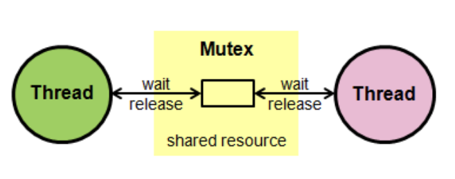
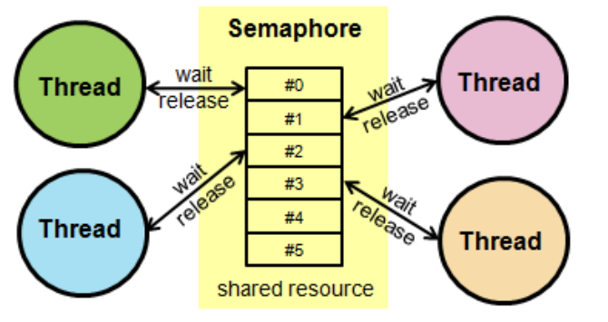
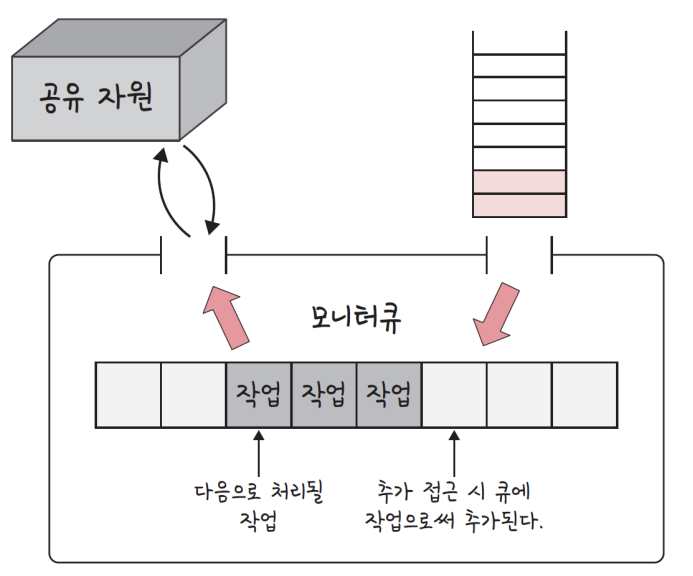

# 뮤텍스, 세마포어, 모니터

> 경쟁상태를 해결하는 대표적인 방법: 뮤텍스, 세마포어, 모니터

- 상호배제, 한정대기, (진행의) 융통성을 만족시키며 프로세스 또는 스레드의 경쟁상태를 해결

| 상호 배제(mutual exclusion) | 한 프로세스가 임계 영역에 들어갔을 때 다른 프로세스는 들어갈 수 없음                                                                                                                       |
| --------------------------- | ------------------------------------------------------------------------------------------------------------------------------------------------------------------------------------------ |
| 한정 대기(bounded waiting)  | 어떤 프로세스도 무한정 기다리지 않고 자원에 대한 접근 권한을 얻을 수 있어야 한다는 원칙. 즉, 프로세스가 자원을 요청하고 받기까지의 대기시간은 한정되어 있다                                |
| 진행의 융통성(progress)     | 사용 가능한 자원에 대해 대기중인 프로세스들이 있다면, 그 중 하나는 반드시 자원을 할당받아 진행할 수 있어야 한다. 시스템이 교착상태(deadlock) 나 기아상태(starvation) 에 빠지지 않아야 한다 |

### 1. 뮤텍스

> 공유 자원을 lock()을 통해 잠금 설정하고, 사용한 후에 unlock()을 통해 잠금 해제가 되는 객체 lock을 기반으로 경쟁 상태를 해결

- 잠금이 설정되면 다른 프로세스나 스레드는 잠긴 코드 영역에 접근할 수 없다. 한 번에 하나의 프로세스만 임계 영역에 있을 수 있다



```cpp
Mutex lock;
void f(){
    mutex_lock(&lock);
    ...
    {Critical Section}
    ...
    mutex_unlock(&lock);
}
```

### 2. 세마포어

> Semaphore, 일반화된 뮤택스

- 간단한 정수 S와 두가지 함수 `wait()`및 `signal()`로 공유자원에 대한 접근을 처리. 이를 통해 여러 프로세스가 동시에 임계 영역에 접근 가능
  - S는 현재 쓸 수 있는 공유자원의 수
  - `wait()`는 S를 1씩 감소시킴. 감소시키나 만약 S가 음수가 된다면 공유자원을 쓸 수 없기 때문에 프로세스는 차단되며, 대기열에 프로세스를 집어넣음
  - `signal()`은 S를 1씩 증가시킴. 공유자원을 프로세스가 다 쓴 상태. 이때 만약 S가 0이하라면 대기열에 있던 프로세스가 동작

ex) 5명의 사용자만이 로그인하여 들어갈 수 있는 게임


```cpp
struct Semaphore {
    int value;
    Queue<process> q; // PCB를 담고 있음.
};
wait(Semaphore s)
{
    s.value = s.value - 1; //공유자원 사용 시작
    if (s.value < 0) {
        // 대기열에다 집어 넣는다.
        q.push(p);
        block();
    } else return;
}
signal(Semaphore s)
{
    s.value = s.value + 1; // 공유자원 사용 완료
    if (s.value <= 0) {
    // 대기열에 있던 프로세스를 끄집어내서 공유자원에 대한 작업을 진행합니다.
        Process p = q.pop();
        wakeup(p);
    }
    else return;
}
```

#### 세마포어의 종류

> 바이너리 세마포어, 카운팅 세마포어

##### 바이너리 세마포어

- S가 0과 1의 두 가지 값만 가질 수 있는 세마포어
- 구현의 유사성으로 인해 뮤택스는 바이너리 세마포어라고 할 수도 있지만, 엄밀히 말하면 뮤택스는 잠금을 기반으로 상호 배제가 일어나는 '잠금 메커니즘'을 사용했고, 세마포어는 신호를 기반으로 상호 배제가 일어나는 '신호 매커니즘'을 사용한 점이 다르다

##### 카운팅 세마포어

- S가 여러 개의 값을 가질 수 있는 세마포어

### 3. 모니터

> monitor, 둘 이상의 스레드나 프로세스가 공유 자원에 안전하게 접근할 수 있도록 공유자원을 숨기고, 해당 접근에 대해 **인터페이스**만 제공하는 객체



### 4. 모니터와 세마포어의 차이

- 모니터는 세마포어보다 구현하기 쉬우며, 한 번에 하나의 프로세스만 공유자원에 접근 가능하기에 상호배제가 자동. 또한 인터페이스를 기반으로 구축
- 세마포어는 모니터보다 구현하기 어려우며 한 번에 여러개의 프로세스가 공유자원에 접근 가능. 이 때문에 상호배제를 명시적으로 구현해야 한다 또한 정수변수를 기반으로 구축
