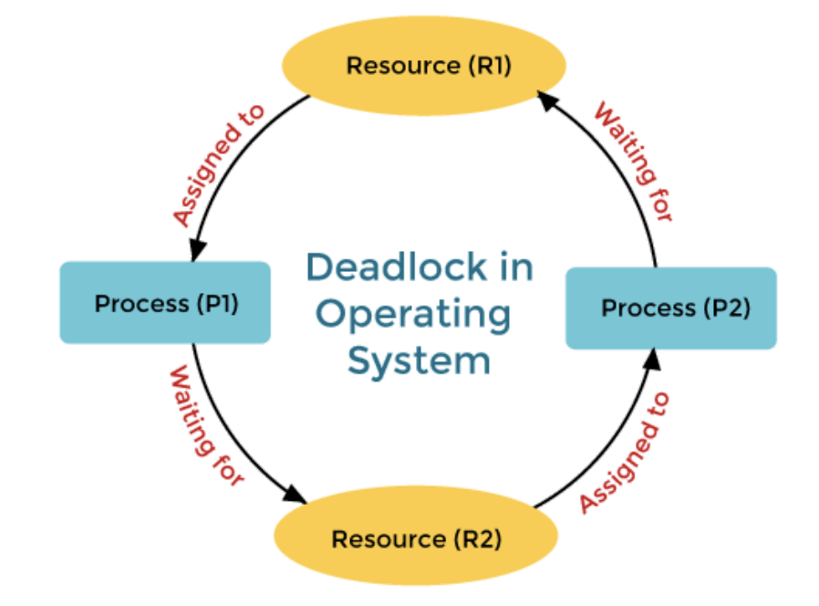

# 교착상태(deadlock)

> 2개 이상의 프로세스들이 서로가 가진 자원을 기다리며 중단된 상태. 이 과정에서 각 프로세스는 서로가 원하는 자원을 유지한 채 다른 프로세스의 자원을 얻기를 기다림

### 1. 교착 상태의 원인

> 교착 상태가 발생하기 위한 4가지 필요 조건

- `상호 배제`: 주어진 시간 내에 하나의 프로세스만 자원을 독점 가능. 즉 다른 프로세스들은 접근이 불가능

- `점유 대기`: 특정 프로세스가 점유한 자원을 다른 프로세스가 요청하며 대기하는 상태
- `비선점`: 다른 프로세스의 자원을 강제적으로 가져올 수 없음
- `환형 대기`: 프로세스 A는 프로세스 B의 자원을 요구하고, 프로세스 B는 프로세스 A의 자원을 요구하는 등 서로가 서로의 자원을 요구하는 상황

  - 참조: 위 4가지 조건이 모두 충족되어도 교착상태는 발생하지 않을 수 있지만, 4가지 조건이 충족되어야지만 "교착상태가 일어날 수"있음

### 2. 교착 상태의 해결 방법

- 1. 자원을 할당할 때 애초에 조건이 성립되지 않도록 설계
- 2. 교착 상태 가능성이 없을 때만 자원 할당되며, 프로세스 당 요청할 자원들의 최대치를 통해 자원 할당 가능 여부를 파악하는 `은행원 알고리즘`의 사용
- 3. 교착 상태가 발생하면 사이클이 있는지 찾아보고 이와 관련된 프로세스를 한 개씩 지운다
- 4.교착상태는 매우 드물게 일어나기 대문에 이를 처리하는 비용이 더 커서 교착상태가 발생하면 사용자가 작업을 종료 ex) 프로세스 실행 중에 '응답없음' 뜨는 것

### 3. 은행원 알고리즘

> Banker's algorithm, 교착 상태를 회피하는 알고리즘으로 총 자원의 양과 현재 할당한 자원의 양을 기준으로 안정 또는 불안정 상태로 나누고, 안정 상태로 가도록 자원을 할당하는 순서를 조절하는 알고리즘

- 안정 상태: 교착상태를 일으키지 않은 상태. 프로세스들의 최대자원요구량을 운영체제가 충족시킬 수 있는 상태
- 불안정상태: 안정상태로 가는 순서열이 존재하지 않는 상태(자원 할당 순서를 어떻게 하든 안정적으로 모든 프로세스를 할당할 수 없는 상태)

- 프로세스가 자원을 요청할 때, 시스템은 해당 요청이 시스템을 안전한 상태로 유지할 수 있는지를 계산. 요청이 안정상태를 유지할 수 있다면 자원을 할당하고, 그렇지 않으면 요청을 거부하거나 대기시킴

#### 은행원 알고리즘의 단점

- 프로세스가 시스템이 들어갈 때 필요한 최대 자원 수를 예측하는 것이 쉽지 않다
- 은행원 알고리즘에 대한 자원 소모량이 증가하게 된다
- 프로그램의 수는 고정되어 있지 않고 항상 변하기 때문에 사용하기 어렵다
