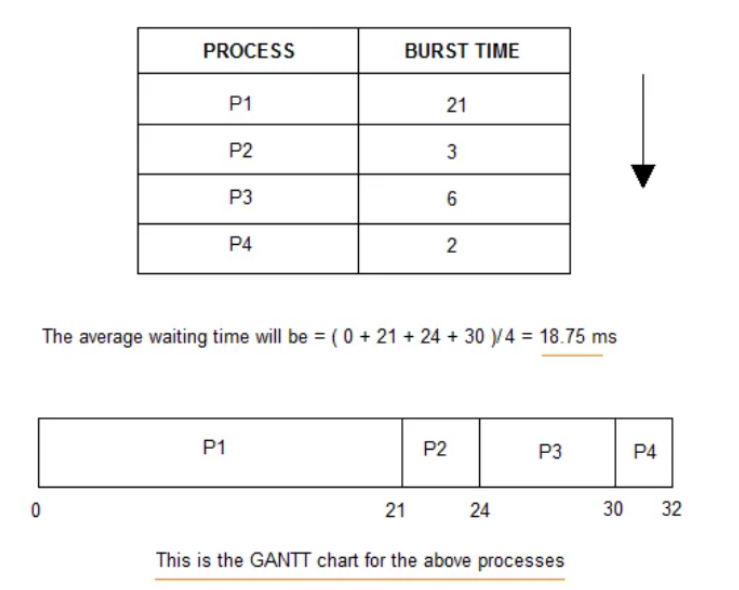
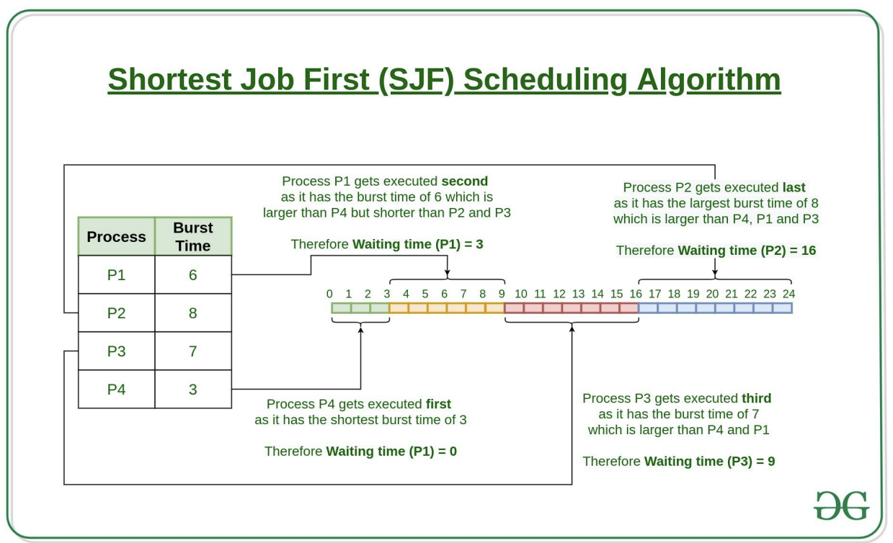

# CPU 스케줄링 알고리즘 - 비선점형 (FCFS, SJF, 우선순위)

- CPU가 어떤 프로세스를 선택할 것인지는 스케줄링 알고리즘을 통해 선택되며, 효율적으로 선택하는 것이 중요하다. 여기서 효울적이라는 것은 다음과 같은 사항을 만족시킬 때 효율적이라고 한다:

1. CPU 사용률이 높은가?
2. 단위 시간 당 작업을 마친 프로세스의 수(처리량)가 높은가?
3. 작업을 요청한 프로세스가 작업을 시작하기 전 대기하는 시간이 짧은가?

- CPU 스케줄링은 2가지 방식이 존재
  - 비선점형(non-preemptive) (FCFS, SJF, 우선순위): 프로세스가 스스로 CPU 소유권을 포기하는 방식이며 강제로 프로세스를 중지하지 않음. 따라서 컨텍스트 스위칭으로 인한 부하가 적음
  - 선점형

### FCFS

> First Come, First Served, 가장 먼저 온 프로세스를 가장 먼저 처리하는 알고리즘

- 길게 수행되는 프로세스 때문에 준비 큐에서 오래 기다리는 현상 (convoy effect)가 발생하는 단점 존재

### SJF

> Shortest Job First, 실행 시간이 짧은 프로세스를 가장 먼저 실행하는 알고리즘.

- 긴 시간을 가진 프로세스가 실행되지 않는 현상(starvation)이 일어날 수 있으며, 평균 대기 시간이 가장 짧다
- 실제로는 실행 시간을 알 수 없기 때문에 과거의 실행했던 시간을 토대로 추측

### 우선순위

> SJF 스케줄링의 경우 긴 시간을 가진 프로세스가 실행되지 않는 단점 존재. 이를 오래된 작업일 수록 **우선순위를 높이는 방법(aging)**을 통해 단점을 보완한 알고리즘

- 우선순위: 작업의 시간, 프로세스의 메모리 요구사항, 열린 파일 수, 평균 CPU 사용량 등을 고려해서 설정된다

- SJF+우선순위 뿐만 아니라 FCFS + 우선순위, 선점형 알고리즘 + 우선순위 스케줄링도 가능
