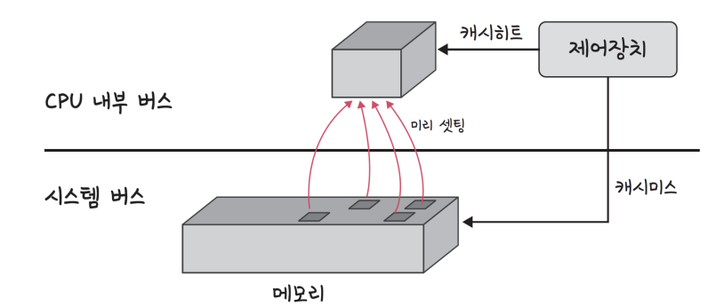

# 캐시 히트와 캐시 미스

### 캐시

- 데이터를 미리 복사해 놓는 임시 저장소이자, 빠른 장치(ex 캐시)와 느린 장치(ex SSD) 사이에서 속도 차이에 따른 병목 현상을 줄이기 위한 메모리

- 데이터 접근 시간의 단축, 데이터를 다시 계산하는 등의 시간 절약 가능

- 예시
  - CPU의 레지스터
    - CPU가 메모리로부터 데이터를 가져올 때의 시간이 너무나 크기 때문에 그 중간에 레지스터 계층을 두어 속도 차이를 해결
  - 데이터베이스 redis db를 캐시 계층으로 사용
  - 웹 서버 앞단에 nginx 서버를 캐시 계층으로 사용

- 캐시 히트: 캐시에서 원하는 데이터를 찾음
- 캐시 미스: 캐시에서 원하는 데이터를 찾지 못함. 캐시 미스가 발생하면 메모리로 가서 원하는 데이터를 레지스터에 등록 가능

### 캐시 - 지역성의 원리

> 캐시를 설정할 때는 자주 사용하는 데이터를 기반으로 설정해야 한다. 이 때 지역성을 기반으로 설정되는데, 지역성은 시간 지역성(temporal locality)와 공간 지역성(spatial locality)로 나뉜다

#### 시간 지역성

- 최근 사용한 데이터에 다시 접근하려는 특성

#### 공간 지역성

- 최근 접근한 데이터를 이루고 있는 공간이나 그 가까운 공간에 접근하려는 특성
