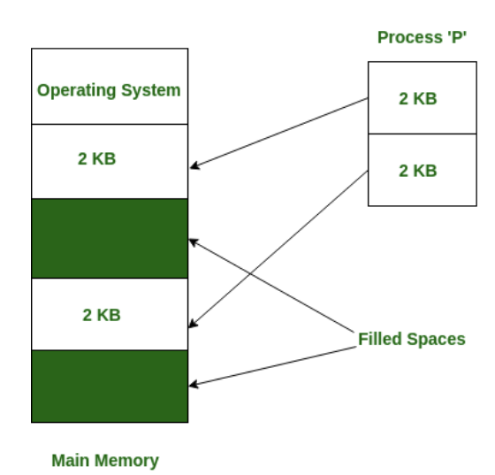

# 메모리할당 - 불연속할당: 페이징, 세그멘테이션, 페이지드 세그멘테이션

> 불연속 할당(non-contiguous memory allocation)

- 메모리를 연속적으로 할당하지 않는 방법. 현대 운영체제가 사용중인 방법.
- 프로그램에 필요한 메모리를 쪼개어 서로 다른 위치에 있는 메모리 공간에 할당
- 대표적으로 페이징, 세그멘테이션, 페이지드세그멘테이션 기법이 존재

### 페이징 (memory paging)

- 동일한 크기 (보통 4kb)의 페이지 단위로 나누어 메모리의 서로 다른 위치에 프로세스를 할당
- 홀의 크기가 균일하지 않은 문제가 없어지지만, 주소 변환을 페이지별로 해야 하기 때문에 주소 변환이 복잡해지는 단점 존재

- 외부 단편화가 해결되지만, 내부 단편화가 생길 수 있다

### 세그멘테이션 (memory segmentation)

- 페이지 단위가 아닌, 의미 단위인 세그먼트(segment)로 나누는 방식
- 프로세스는 코드, 데이터, 스택, 힙으로 나누어져서 메모리가 할당되는데, 코드와 데이터 또는 코드와 스택 등으로 나눌 수도 있으며 함수 단위로 나눌 수도 있음을 의미

- 공유와 보안 측면에서 좋지만 홀 크기가 균일하지 않게 된다
- 내부 단편화가 해결될 수 있지만 외부 단편화 발생 가능

### 페이지드 세그멘테이션 (paged segmentation | segmentation with paging)

- 세그멘테이션으로 나누되, 해당 세그멘테이션을 동일한 크기의 페이지로 나누는 방법
