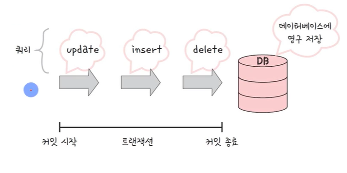
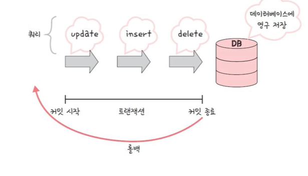

# 트렌잭션 커밋, 롤백, 트렌잭션 전파

## 트랜잭션과 무결성

### 트랜잭션

> 데이터베이스의 상태를 변화시키는 하나의 작업 단위. 이 단위는 전부 실행되거나 전부 실행되지 않아야 한다(Atomicity)

- 데이터베이스에 접근하는 방법은 쿼리이므로, 여러 개의 쿼리들을 하나로 묶는 단위를 뜻함

### 커밋과 롤백

- commit: 여러 쿼리가 성공적을 처리되었다고 확정짓는 명령어
  - 트랜잭션 단위로 수행되며, 변경된 내용이 모두 영구적으로 저장되는 것을 말한다

> commit이 수행 되었다 = 하나의 트랜잭션이 성공적으로 수행되었다

- update, insert, delete ... 쿼리들이 하나의 트랜잭션 단위로 수행되고, 커밋 시 데이터베이스에 영구 저장됨

  

- 롤백: 트랜젝션으로 처리한 하나의 묶음 과정을 일어나기 전으로 돌리는 일 (취소)

- 이러한 commit과 rollback 덕에 데이터의 무결성이 보장된다
- 또한 데이터 변경 전에 변경 사항을 쉽게 확인할 수 있고, 해당 작업을 그룹화할 수 있음
- 트랜잭션으로 묶는 로직에 외부 API 호출은 자제해야 한다(롤백도 생각해야 하기 때문)

### 트랜잭션 전파

- 트랜잭션이 다른 트랜잭션에 어떻게 영향을 미치는지 정의
- `@Transactional 어노테이션 내에서 propagation 속성을 설정함으로써, 트랜잭션의 전파 방식을 제어

- Spirng 프레임워크에서는 `@Transactional` 어노테이션을 통해 여러 쿼리 관련 코드들을 하나의 트랜잭션으로 처리
  - 이 어노테이션이 적용된 메서드 호출 시 Spring은 자동으로 트랜잭션을 시작하고, 매서드 실행이 완료되면 트랜잭션을 커밋. 예외가 발생하면 트랜잭션을 롤백

