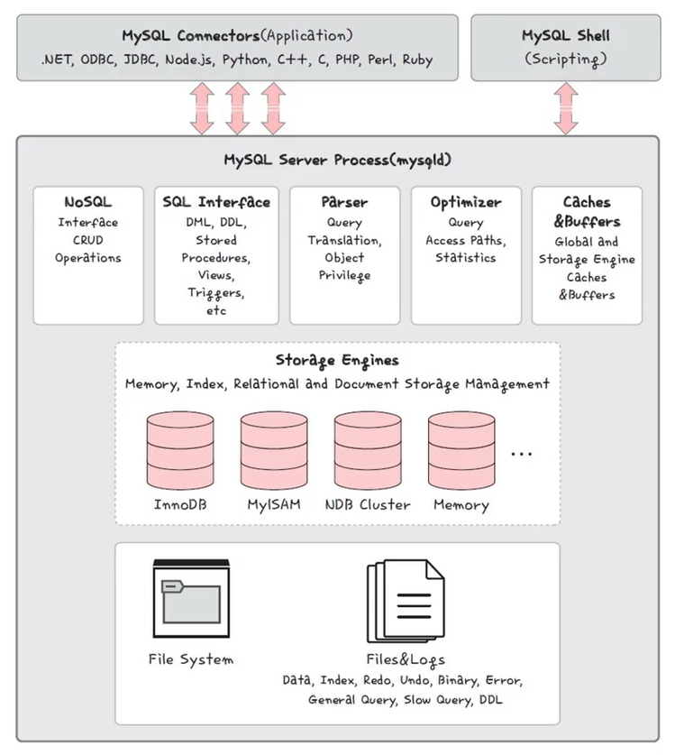
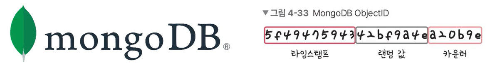

# 관계형 DB와 NoSQL DB의 차이

### 관계형 데이터베이스 (RDBMS)

- 행과 열을 가지는 표 형식 데이터를 저장하는 형태의 데이터베이스
- SQL 언어를 사용
- MySQL, PostgreSQL, 오라클, SQL Server, MSSQL 등이 존재
- 관계형 데이터베이스의 경우 표준 SQL은 지키기는 하지만, 각각의 제품에 특화시킨 SQL을 사용
  - 오라클의 경우 PL/SQL
  - SQL Server 는 T-SQL
  - MySQL은 SQL을 사용

#### MySQL

- 대부분의 운영체제와 호환되며, 가장 많이 사용하는 데이터베이스
- MyISAM 인덱스 압축 기술, B-트리 기반의 인덱스, 스레드 기반의 메모리 할당 시스템, 매우 빠른 조인, 최대 64개의 인덱스를 제공하는 특징
- 대용량 데이터베이스를 위해 설계되어 있고, 롤백, 커밋, 이중 암호 지원 보안 등의 기능을 제공하며 많은 서비스에서 사용

- 데이터베이스의 심장과도 같은 역할을 하는 곳이 **스토리지 엔진**인데, 모듈식 아키텍처로 쉽게 스토리지 엔진을 바꿀 수 있으며(InnoDB, MyISAM, .. 중 선택), 데이터 웨어하우징, 트랜잭션 처리, 고가용성 처리에 강점을 두고 있음
- MySQL의 default 스토리지 엔진은 InnoDB
- 스토리지 엔진 위에는 커넥터 API 및 서비스 계층을 통해 MySQL 데이터베이스와 쉽게 상호 작용
- 또한 쿼리 캐시를 지원해서 입력된 쿼리문에 대한 전체 결과 집합을 저장하기 때문에 사용자가 작성한 쿼리가 캐시에 있는 쿼리와 동일하면 서버는 단순히 구문 분석, 최적화 및 실행을 건너뛰고 캐시의 출력만 표시

#### PostgreSQL

- 디스크 조각이 차지하는 영역을 회수할 수 있는 장치인 VACUUM이 특징
- 최대 테이블의 크기는 32TB이며 SQL 뿐만 아니라 JSON을 이용해서 데이터에 접근 가능
- 지정 시간에 복구하는 기능, 로깅, 접근제어, 중첩된 트랜잭션, 백업 가능

### NoSQL 데이터베이스

- Not Only SQL 이라는 슬로건에서 생겨난 데이터베이스
- SQL을 사용하지 않는 데이터베이스를 말하며 유연한 스키마, 확장성이 특징
- 대표적으로 MongoDB와 redis

#### MongoDB

- JSON을 통해 데이터에 접근할 수 있고, Binary Json 형태 (BSON)로 데이터가 저장되며 와이어드 타이거 엔진이 기본 스토리지로 장착된 키-값 데이터 모델에서 확장된 도큐먼트 기반의 데이터베이스
- 확장성이 뛰어나며, 빅데이터를 저장할 때 성능이 좋고, 고가용성과 샤딩, 레플리카셋을 지원
- 또한 스키마를 정해놓지 않고 데이터를 삽입할 수 있기 때문에 다양한 도메인의 데이터베이스를 기반으로 분석하거나 로깅 등을 구현할 때 강점
- 또한 도큐먼트를 생헝할 때마다 다른 컬렉션에서 중복된 값을 지니기 힘든 유니크한 값인 ObjectId가 생성됨
- 이는 기본키로 유닉스 기반의 타임스탬프(4바이트), 랜덤값(5바이트), 카운터(3바이트)로 구성

#### redis

- 인메모리 데이터베이스이자 키-값 데이터 모델 기반의 데이터베이스
- 기본적인 타입은 String이며 최대 512MB 까지 저장 가능
  - 이외에도 set, hash 등을 지원
- pub/sub 기능을 통해 채팅 시스템, 다른 데이터베이스 앞단에 두어 사용하는 캐싱 계층, 단순히 키-값이 필요한 세션 정보 관리, 정렬된 set 자료구조를 이용한 실시간 순위표 서비스에 사용

### 관계형 데이터베이스와 NoSQL 데이터베이스의 차이

> 1. Key와 Value 형태의 도큐먼트

- MongoDB 내의 도큐먼트는 key-value 형태로 이루어지며 `_id`라는 고유한 아이디를 가짐
- DB에 저장될 때 key의 길이도 내용으로 들어감
- MongoDB는 JSON 형태로 쿼리를 만들고, JSON을 매개변수로 받아 BSON 형태로 DB에 삽입, 추출하는 것이 가능
- type 변환이 일어나지 않으며 JSON 데이터를 주고받을 때 성능 면에서 더 좋은 선택 >> 자바스크립트 풀스택 아키텍처에 장점

> 2. 스키마 없이 삽입 가능

- RDBMS와 달리 MongoDB는 스키마 없이 데이터 모델을 구현하지 않은 채 유동적으로 데이터를 삽입할 수 있음.
- 스키마란 데이터베이스를 구성하는 속성, 관계 등 데이터 값이 갖는 type을 명시해 놓은 것
- 다양한 서비스로부터 데이터를 유동적으로 쌓을 수 있음

- 하지만 스키마를 미리 설정해놓고 DB에 저장하는 RDBMS는 칼럼의 길이가 DB에 저장되지 않지만, MongoDB는 저장됨
- 예를 들어 RDBMS에서는 한 스키마가 int , char[14] 인 경우 그 안에 들어가는 데이터 18 바이트만, 저장되지만, MongoDB는 한 도큐먼트로 칼럼 이름도 바이트에 추가된다. 예를들어 comments: String 타입으로 정해놓고 DB에 저장한다면 Comments 라는 길이의 byte 즉 8byte가 각각 더 들어가게 된다

> 3. 데이터의 조합함수 지원

- MongoDB에서는 min, max, aggregate, mapReduce등 강력한 함수로 데이터를 추출하고 조합해서 압축된 결과값을 만들 수 있음

> 4. 이중화 지원과 샤딩

- 서버는 멈추면 안되기 때문에 운영서버의 경우 서버 이중화를 진행
- 이 때 MongoDB는 ReplicaSet을 통해 이중화를 가능하게 함

- 또한 데이터의 양이 많은 경우 샤딩을 통해 collection을 분할해 관리할 수 있음

> 5. json 형태의 Data

- MongoDB는 BSON 형태로 저장되며 JSON 형태의 값으로 추출 가능
- JSON Object를 매개변수로 받아 쉽게 저장 가능

> 6. 2차원 좌표 인덱싱

- geoSpartial 인덱스를 써서 2차원 좌표 인덱싱 가능

> 7. collection join

- $lookup 을 통한 collection join이 가능

> 8. B-tree를 적용한 인덱싱

- 무언가를 찾고자 할 때 사용되는 것이 인덱싱
- 인덱싱이 있어야 빠르게 데이터를 찾을 수 있음
- 인덱스의 기본 정렬은 항상 오름차순으로 구현되지만, 데이터를 추출할 때 또는 인덱스를 초기에 설정할 때는 오름차순이나 내림차순으로 변경 가능
- 인덱스는 B-Tree로 구성되어 있고 2차원 좌표 인덱싱의 경우 R-tree로 구성
