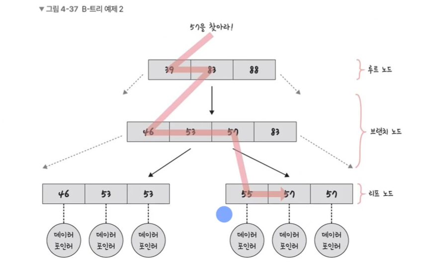

# 인덱스의 구조와 효율적인 이유

### 정의

- 데이터를 빠르게 찾을 수 있는 하나의 장치 (ex 책의 목차)
- 인덱스를 설정하면 테이블안에 내가 찾고자 하는 데이터를 빠르게 찾을 수 있다

> 인덱스 왜 효율적?

- 균형잡힌 B-Tree 기반으로 구축되어 있어서 탐색에 평균 `O(logN)` 시간이 걸리며 트리 생성시의 대수확장성이란 특징으로 인해 더 빠른 시간 안에 많은 양의 데이터를 빠르게 찾을 수 있기 때문

### 인덱스와 B 트리

- 인덱스는 보통 B 트리라는 자료구조로 구성

  - B 트리란? 루트 노드, 리프 노드, 브랜치노드(중간 노드)로 구성되어 있으며 이진 트리를 확장해 하나의 노드가 가질 수 있는 자식 노드의 최대 숫자가 2보다 큰 트리 구조를 가진 균형잡힌 트리

- 예를 들어 E를 찾는다고 하면 전체 테이블을 탐색하는 것이 아니라 E가 있을 법한 리프 노드로 들어가서 E를 탐색하면 쉽게 찾을 수 있다
- 이를 자료구조 없이 E를 탐색하고자 한다면 선형적으로 모두 탐색해야 하지만, 노드들로 나누면 적은 숫자만에 리프 노드에서 찾을 수 있다

### 인덱스가 효율적인 이유와 대수확장성

- 대수확장성 = 트리 깊이가 리프 노드 수에 비해 매우 느리게 성장하는 것.
  - 자식 노드가 2개보다 더 많을 수 있기 때문
- 기본적으로 인덱스가 한 깊이 증가할 때마다 최대 인덱스 항목의 수는 4배씩 증가
