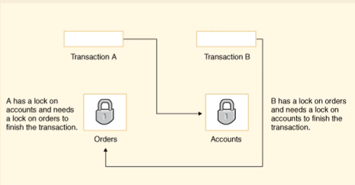

# 데이터베이스의 데드락과 해결 방법

## 데이터베이스의 교착 상태(Deadlock)

### 데드락

- 데이터베이스에서 교착 상태는 둘 이상의트랜잭션이 서로가 잠금을 포기하기를 기다리는 상황

### 데드락의 해결

> 교착상태 감지

1. 교착 상태 감지 및 timeout

- 일정 시간(timeout) 이후, 트랜잭션이 실행되지 않았을 경우 롤백

2. 그래프 기반으로 사이클 탐색

- 그래프 내의 사이클이 형성되었다는 것을 기반으로 교착상태를 감지

=> 하지만 대규모 데이터베이스의 경우 교착상태를 하나하나 감지하기에 코스트가 크기 때문에 교착 상태 방지를 자주 사용

> 교착상태 방지

- 최대한 교착상태가 일어나지 않게 방지

1. 격리 수준 변경

- 교착 상태를 방지하기 위해 격리수준을 행 잠금 또는 격리 수준을 조정하는 것
- serializable이 아닌 이상 모든 교착 상태를 완전히 제거하는 것은 아님

2. 서비스의 로직을 교차되지 않게 수정

> **wait-die 또는 wound-wait 방법**

- 타임스탬프를 기반으로 트랜잭션을 대기, 선점, 종료하는 방식
- Timestamp: 1970-01-01 00:00:01 부터의 초수 (클수록 최신)

1. Wait-Die 방식 : 교착 상태 방지를 위한 비선점기법
   "대기하거나 죽거나": 오래된 것이 요구하면 대기하고 최신 것이 요구하면 최신 것은 죽임

- 예시

| 트랜잭션 | 타임스탬프 |
| -------- | ---------- |
| T1       | 5          |
| T2       | 10         |
| T3       | 15         |

- T1이 T2가 보유한 데이터 항목을 요구하면 T1은 대기
- T3가 T2가 보유한 데이터 항목을 요청하면 T3는 죽음

2. wound-wait 방식: 교착 상태 방지를 위한 선점 기법
   "상처를 입거나 대기하거나" : 오래된 것이 요구하면 최신 것은 강제로 일시정지. 데이터는 오래된 것이 가져감, 최신 것이 요구하면 대기

| 트랜잭션 | 타임스탬프 |
| -------- | ---------- |
| T1       | 5          |
| T2       | 10         |
| T3       | 15         |

- T1이 T2가 보유한 데이터 항목을 요청하면 데이터가 T2에서 선점되고 T2가 일시 중단 (wound)
- T3가 T2가 보유한 데이터 요청 시 T3은 대기
