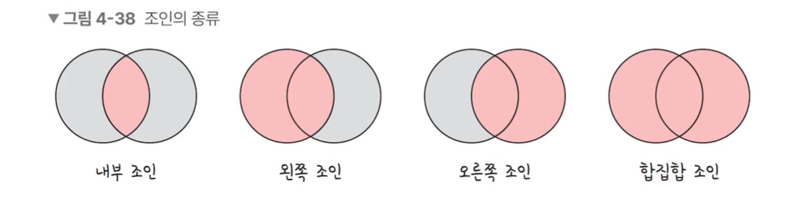

# 조인(Join)

> 두 개 이상의 테이블을 묶어서 하나의 결과물을 만드는 것

- NoSQL (ex MongoDB)의 경우 관계형 데이터베이스에 비해 Join이 성능이 떨어지기 때문에, 여러 테이블을 조인하는 작업이 많을 경우 MongoDB 보다는 관계형 데이터베이스를 사용해야 한다

- 내부조인(inner join): 왼쪽 테이블과 오른쪽 테이블의 두 행이 모두 일치하는 행이 있는 부분만 표기
- 왼쪽 조인 (left outer join): 왼쪽 테이블의 모든 행이 결과 테이블에 표기
- 오른쪽 조인 (right outher join): 오른쪽 테이블의 모든 행이 결과 테이블에 표기
- 합집합 join(full outer join): 두 개의 테이블을 기반으로 조인 조건에 만족하지 않는 행까지 모두 표기

# 조인의 원리

> 중첩 루프 조인, 정렬 병합 조인, 해시 조인

### 중첩 루프 조인 (Nested Loop Join)

- 중첩 for문과 같은 원리로 조건에 맞는 조인을 하는 방법
- 랜덤 접근에 대한 비용이 많이 증가하므로 대용량의 테이블에서는 사용하지 않음
- 첫 번째 테이블에서 행을 한 번에 하나씩 읽고 그 다음 테이블에서도 행을 하나씩 읽어 조건에 맞는 레코드를 찾아 결과값을 반환

### 정렬 병합 조인

- 각각의 테이블을 조인할 필드 기준으로 정렬하고, 정렬이 끝난 이후에 조인 작업을 수행하는 조인
- 조인할 때 사용할 적절한 인덱스가 없고, 대용량의 테이블들을 조인하고 조인 조건으로 <, > 등 비교 연산자가 있을 때 사용

### 해시 조인

- `==` 조건에만 사용됨. 두 개의 테이블을 조인한다고 했을 때 바이트 상 더 작은 테이블을 해시 테이블로 만들어서 조인
