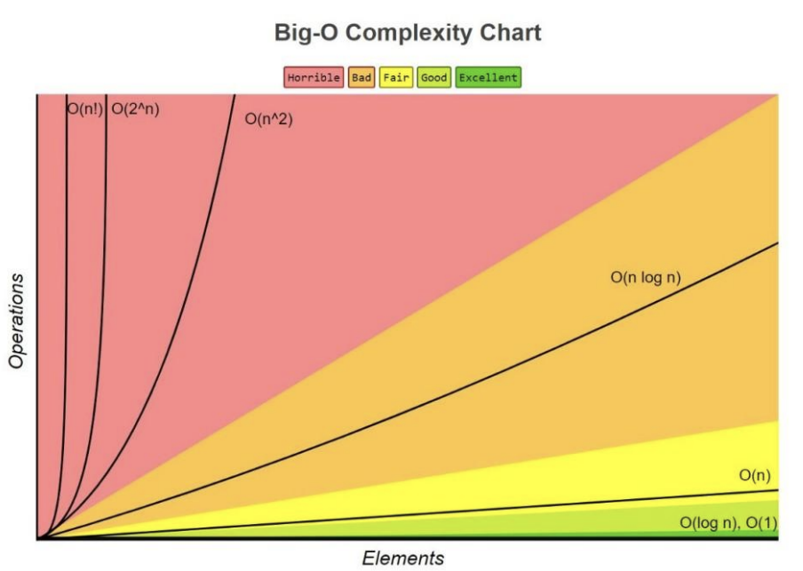

# 빅오표기법 (Big O notation)

10n^2 + n과 같은 시간 복잡도를 빅오표기법으로 나타내면? => O(n^2)

### 1. 정의

> 복잡도에 가장 영향을 많이 끼치는 항의 `상수인자`를 빼고, `나머지 항을 없애서` 복잡도를 나타내는 표기법

### 2. 빅오표기법 차트

> n! > 2 ^ n > n ^2 > nlogn > n > logn > 1

> 

- n! 1 2 6 24 120
- 2^n 1 2 4 8 16
- n 1 2 3 4 5

### 3. 상수시간 시간 복잡도 O(1)

- 입력 크기와 상관없이 일정한 시간 복잡도를 가지는 것
- O(1)

예시

- 입력과 출력
- 곱하기 나누기 나머지 연산 빼기 더하기
- 간단한 if 비교문
- 배열의 인덱스 참조

```java
int a[3] = {1,2,3};
int b = a[2];
```
