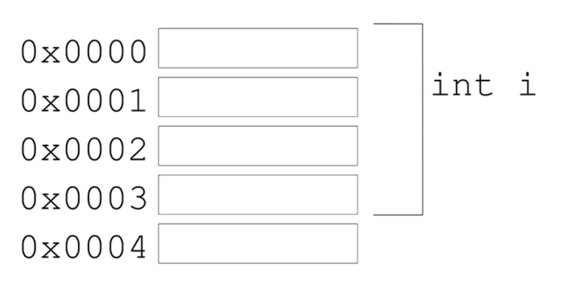
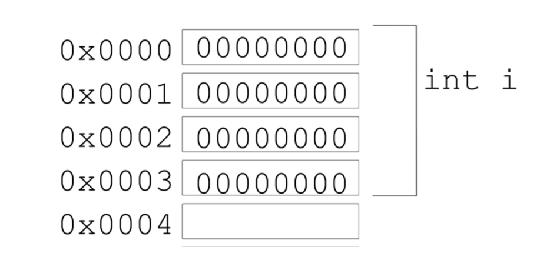

# 메모리와 포인터 - 메모리와 주소

> int i; 선언 시 발생하는 일?

- 컴퓨터의 메모리는 메모리 셀의 연속과 같다
- 각 셀의 크기는 1 바이트이고 고유한 주소를 가지고 있다
- 만약 유저의 컴퓨터의 메모리가 128GB라면, 메모리에서 4바이트 정수 타입인 int 타입의 변수를 저장하기 위해 128GB 중 4바이트의 메모리 영역을 예약해야 한다

- 이렇게 예약한 메모리 영역인 0X0000, 0X0001,.. 등의 주소가 가리키는 영역에 int i라는 변수가 들어가게 된다
- 그렇다면 이 변수 i의 메모리 주소는?

  - 변수가 사용하는 메모리 주소의 첫 번째 = 0X0000

- 실제 메모리 주소는 16진수로 표현 된다 ex) 0x100bbc000

- 변수 i에 0이라는 값을 할당하게 되면?
  - 값 할당 전과 후에 메모리 주소는 변경되지 않는다
  - 예약한 메모리 영역에 값 0 이 저장된다

