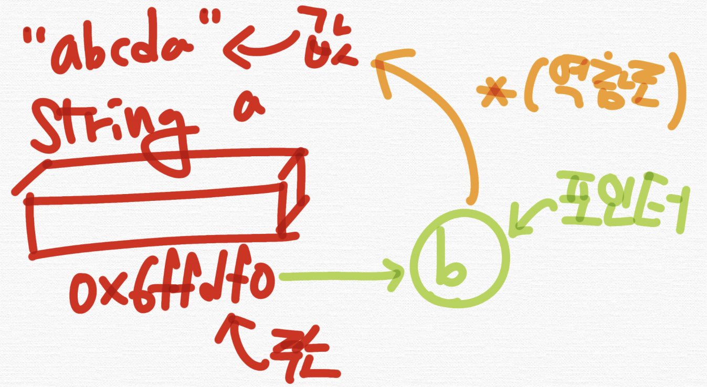

# 역참조 연산자

- C++에서 \* (에스터리스크) 기호는 사용하는 위치에 따라 다양한 용도로 사용된다

  - 이항 연산자: 곱셈
  - 포인터 타입의 선언
  - 역참조(dereference)로 메모리를 기반으로 변수의 값에 접근

- 주소값을 담은 포인터에 역참조 연산자를 통해 값을 참조할 수 있다

```cpp
#include<bits/stdc++.h>
using namespace std;
int main(){
    string a = "abcda";
    string * b = &a;
    cout << b << "\n";
    cout << *b << "\n";
    return 0;
    /*
    0x6ffdf0
    abcda
    */
}
```


