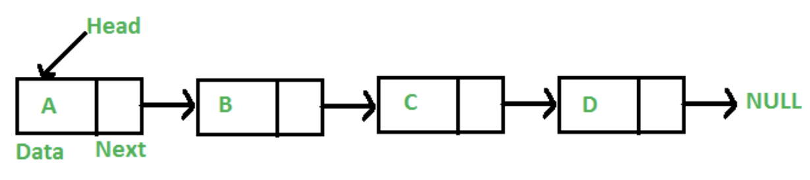
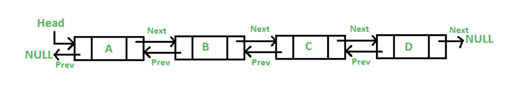

# 연결리스트 (linked List)와 랜덤 접근과 순차적 접근

### 1. 연결 리스트 (linked List)

- 노드로 감싸진 요소를 인접한 메모리 위치가 아닌 독립적으로 저장하며, 각 노드는 next 또는 next, prev라는 포인터로 서로 연결된 선형적 자료 구조
- 연결 리스트의 종류: 싱글 연결 리스트 (next), 이중 연결 리스트 (next, prev), 원형연결리스트

### 2. 노드

- data, next로 이루어진 구조체 (싱글 연결 리스트 기준)
- 특정 값을 담는 data, 노드와 노드를 잇는 next라는 포인터로 구성

```
class Node {
public:
    int data;
    Node* next; // 포인터
    Node(){
        data = 0;
        next = NULL;
    }
    Node(int data){
        this->data = data;
        this->next = NULL;
    }
};

```

#### 연결리스트의 시간 복잡도

- 참조 : O(n)
  - 랜덤 접근이 불가능
- 탐색 : O(n)
  - 배열과 동일
- 삽입/삭제: O(1)

  - 중간에 연결된 포인터를 끊고, 새로운 노드를 추가하거나 노드 하나를 삭제하면 되기 때문

- 연결리스트는 선형적

### 3. 싱글 연결 리스트

- Singly Linked List
- next 포인터밖에 존재하지 않으며 한 방향으로만 데이터가 연결



### 4. 이중 연결 리스트

- Doubly Linked List
- prev, next 2개의 포인터로 양방향으로 데이터가 연결



### 5. 원형 연결 리스트

- Circular Linked List
- 마지막 노드와 첫 번째 노드가 연결되어 원을 형성
- 원형 싱글 연결 리스트와 원형 이중 연결 리스트가 존재

### 6. 랜덤 접근과 순차적 접근

> 직접 접근이라고도 하는 랜덤 접근(random access)는 동일한 시간에 배열과 같은 순차적인 데이터가 있을 때, 임의의 인덱스에 해당하는 데이터에 접근할 수 있는 기능. 데이터를 저장된 순서대로 검색해야 하는 순차적 접근(sequential access)와는 반대

- 연결리스트는 순차적 접근만 가능하고 랜덤 접근이 불가능
- vector, array 와 같은 배열은 랜덤 접근이 가능해서 n 번째 요소에 접근할 때 O(1)이 걸리며, 연결 리스트, 스택 큐는 순차적 접근만이 가능해서 n 번째 요소에 접근할 때 O(n)이 걸린다
