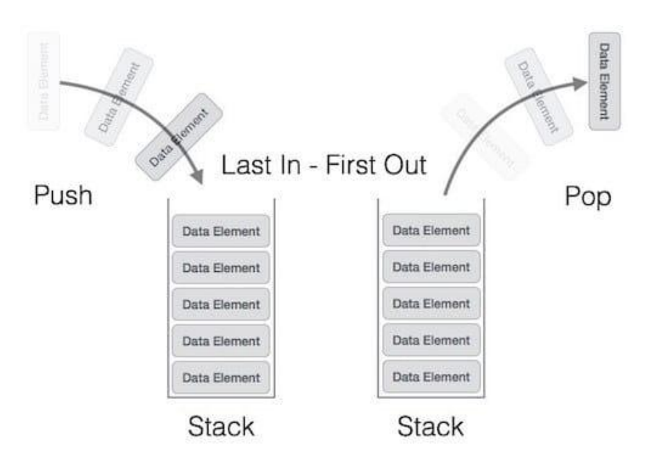

# 스택(stack)

> 가장 마지막으로 들어간 데이터가 가장 첫 번째로 나오는 성질인 후입선출(LIFO, last in first out)을 가진 자료구조. 재귀적인 함수, 알고리즘에 사용되며 웹 브라우저 방문 기록 등에 사용됨

### 1. 시간복잡도

- n번째 참조: O(n)
- 가장 앞(위)부분 참조: O(1)
- 탐색: O(n)
- 삽입/삭제 (가장 위에 삽입/삭제): O(1)



### 2. Java stack 관련 메서드 정리

- stack 선언

```java
import java.util.Stack;

Stack<자료형> stack = new Stack<>();
```

- 메서드

| 종류                           | method                 | 반환값                                                                  |
| ------------------------------ | ---------------------- | ----------------------------------------------------------------------- |
| 삽입                           | stack.push(value);     | 삽입한 value                                                            |
| 삽입                           | stack.add(value);      | boolean true : 성공 , false (실패, stackOverflow)                       |
| 삭제                           | stack.pop();           | 삭제한 value. 빈 stack의 경우 EmptyStackException                       |
| 삭제                           | stack.remove(idx);     | 삭제한 value. 잘못된 idx 입력시 ArrayIndexOutOfBoundsException          |
| 맨위원소 반환                  | stack.peek();          | 맨 위 원소 value                                                        |
| 크기                           | stack.size();          | 스택에 저장된 value의 개수                                              |
| 빈 스택인지 확인               | stack.isEmpty();       | true/false                                                              |
| 특정 value 존재하는지 확인     | stack.search(value);   | top 기준 value의 위치 (1 ~stack.size())/ 존재하지 않으면 -1             |
| 스택 값 변경                   | stack.set(idx, value); | 변경 전 value , 잘못된 idx의 경우 ArrayIndexOutOfBoundsException        |
| 해당 인덱스에 존재하는 값 반환 | stack.elementAt(idx);  | 인덱스에 저장된 value. 잘못된 idx의 경우 ArrayIndexOutOfBoundsException |
| 스택 초기화                    | stack.clear();         | 반환값 없음                                                             |
