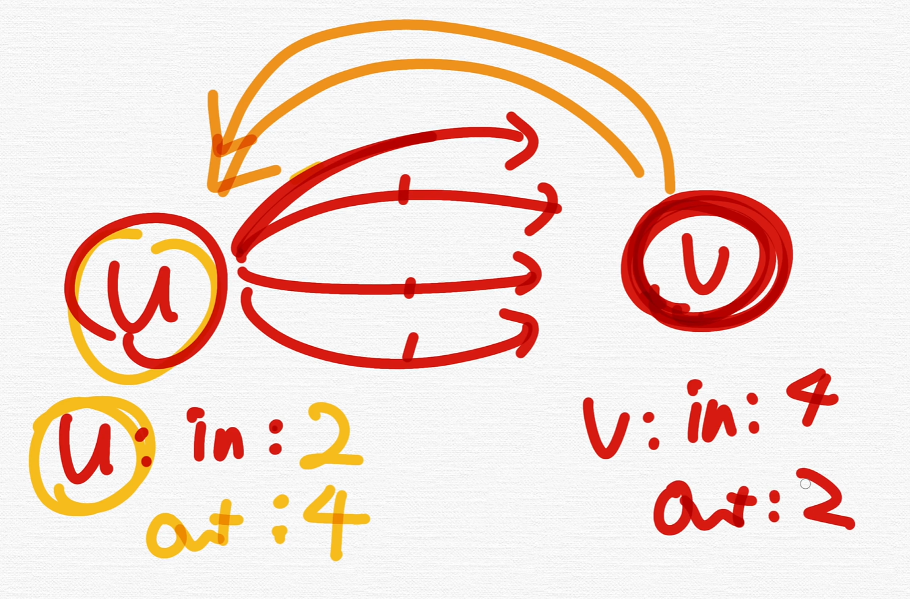

# 그래프 이론의 기초 (Graph, Vertex, Edge, Weight)

### 1. 정점과 간선

- 정점(vertex)

  - node 라고도 함. 그래프를 형성하는 기본 단위
  - 분할할 수 없는 객체이자 "점"으로 표현되는 위치, 사람, 물건

- 간선(Edge)

  - 정점을 잇는 선. 관계. 경로
  - 단방향 간선과 양방향 간선이 존재

- 그래프
  - 정점과 간선들로 이루어진 집합

### 2. indegree outdegree

- indegree: 하나의 정점으로 들어오는 간선
- outdegree: 하나의 정점으로부터 다른 정점으로 나가는 간선

### 3. 가중치

- 정점과 정점 사이에 드는 비용
