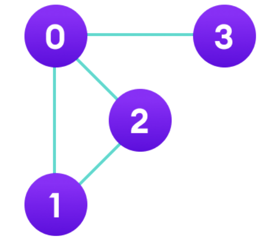

# 인접행렬 (adjacency matrix)

> 그래프를 어떻게 컴퓨터에 알려줄 수 있을까? -> 인접 행렬과 인접 리스트 사용

- 참조: 무방향 그래프는 양방향 그래프로 볼 수 있음

### 1. 인접 행렬

> 그래프에서 정점과 간선의 관계를 나타내는 bool 타입의 정사각형 행렬

- 정사각형 행렬의 각 요소가 0 또는 1의 값을 가짐. 0은 두 정점 사이의 경로가 없음을 의미하며, 1은 두 정점 사이의 경로가 있음을 의미
- 자신과 자신간의 경로의 경우 사이클이 없을 때는 0, 사이클이 있을 때는 1로 표기
- 인접행렬의 가로=세로의 길이=노드의 수 (메모리를 최소로 사용할 경우)

#### 연습




```cpp
bool a[4][4] = {
{0, 1, 1, 1},
{1, 0, 1, 0},
{1, 1, 0, 0},
{1, 0, 0, 0},
};
```

```java
a[0][1] = 1
```

- 0 노드에서 1노드로 가는 간선이 존재한다

```java
a[3][2] = 0
```

- 3노드에서 2노드로 가는 간선이 존재하지 않는다

---

#### 문제로 푸는 인접행렬

Q1> 3번 노드에서 5번 노드로 가는 단방향 경로가 있고, 이를 인접 행렬로 표현하면?

```java
a[3][5] = 1
```

Q2 > 3번 노드에서 5번 노드로 가는 양방향 경로가 있고, 이를 인접 행렬로 표현하면?

```java
a[3][5] = 1
a[5][3] = 1
```

Q3 > 정점의 개수가 20개인 그래프 존재. 이를 인접 행렬로 표현한다고 했을 때 메모리를 최소로 쓴다고 할 때 배열을 어떻게 만들어야 할까?

```cpp
bool a[20][20]
```

Q4 > 정점은 0번 부터 9번까지 10개의 노드가 있다. 1 - 2 / 1 - 3 / 3 - 4 라는 경로가 있다.
(1번과 2번, 1번과 3번, 3번과 4번은 연결되어있다.)
이를 이를 인접행렬로 표현한다면?

Q5 > 0번부터 방문안한 노드를 찾고 해당 노드부터 방문, 연결된 노드를 이어서 방문해서
출력하는 재귀함수를 만들고 싶다면 어떻게 해야할까? 또한, 정점을 방문하고 다시
방문하지 않게 만드려면 어떻게 해야할까?

```java
import java.util.*;

public class DepthFirstSearch {
    static final int V = 10;
    static boolean[][] a = new boolean[V][V]; //인접행렬 정의
    static boolean[] visited = new boolean[V]; // 방문여부 배열

    static void go(int from) {
        visited[from] = true;
        System.out.println(from);

        for (int i = 0; i < V; i++) {
            if (visited[i]) continue;
            if (a[from][i]) {
                go(i);
            }
        }
    }

    public static void main(String[] args) {
        a[1][2] = true;
        a[1][3] = true;
        a[3][4] = true;
        a[2][1] = true;
        a[3][1] = true;
        a[4][3] = true;

        for (int i = 0; i < V; i++) {
            for (int j = 0; j < V; j++) {
                if (a[i][j] && !visited[i]) {
                    go(i);
                }
            }
        }
    }
}

```
