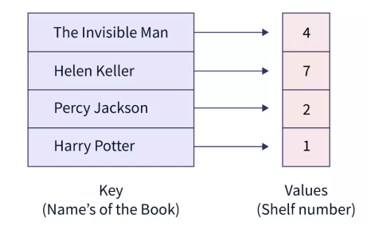

# 맵 (Map)

> 고유한 키를 기반으로 키 -값 (key-value) 쌍으로 이루어진 정렬된(삽입할 때마다 자동 정렬되는) 자료구조
> 균형잡힌 이진탐색트리인 레드-블랙 트리로 구현

### 시간복잡도

- 참조 : O(logn)
- 탐색 : O(logn)
- 삽입 / 삭제 : O(logn)



- 고유한 key 값을 갖기 때문에 중복된 key가 있을 수 없으며, key 값 기준 자동으로 오름차순 정렬되기에 넣은 순서대로 map을 탐색할 수 있는 것이 아니라, 아스키코드 순으로 정렬된 값들을 기반으로 탐색
- 키로 직접 참조가 가능하다

```java
import java.util.HashMap;
import java.util.Map;

public class Main {
    public static void main(String[] args) {
        Map<String, Integer> mp = new HashMap<>();
        String[] a = {"주홍철", "양영주", "박종선"};

        // map에 {key, value} 삽입
        for (int i = 0; i < 3; i++) {
            mp.put(a[i], i + 1);
        }

        System.out.println(mp.get("주홍철"));
        System.out.println(mp.size());

        // key에 해당하는 요소 삭제
        mp.remove("주홍철");

        // map에서 해당 key를 찾음
        if (!mp.containsKey("kundol")) {
            System.out.println("맵에서 해당 요소는 없습니다.");
        }

        // 대괄호[] 대신 put을 사용하여 삽입
        mp.put("kundol", 100);

        // map 순회
        for (Map.Entry<String, Integer> entry : mp.entrySet()) {
            System.out.println(entry.getKey() + " : " + entry.getValue());
        }

        // map의 모든 요소 제거
        mp.clear();
        System.out.println("map의 사이즈는 : " + mp.size() + "입니다.");
    }
}
```
