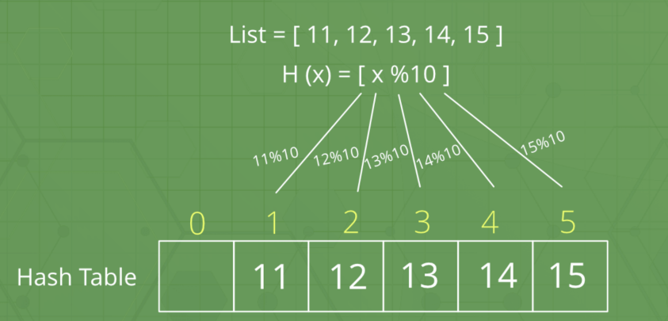
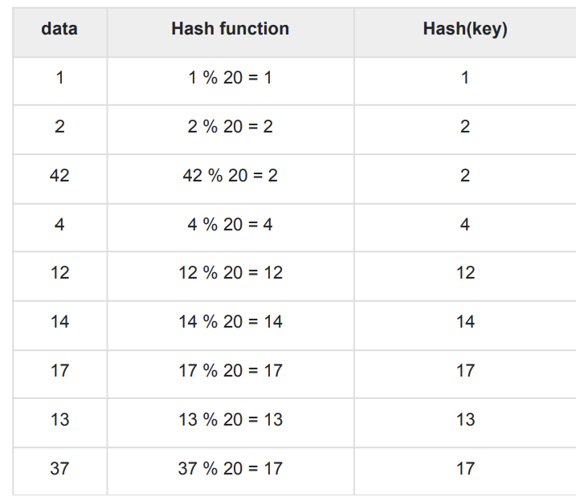
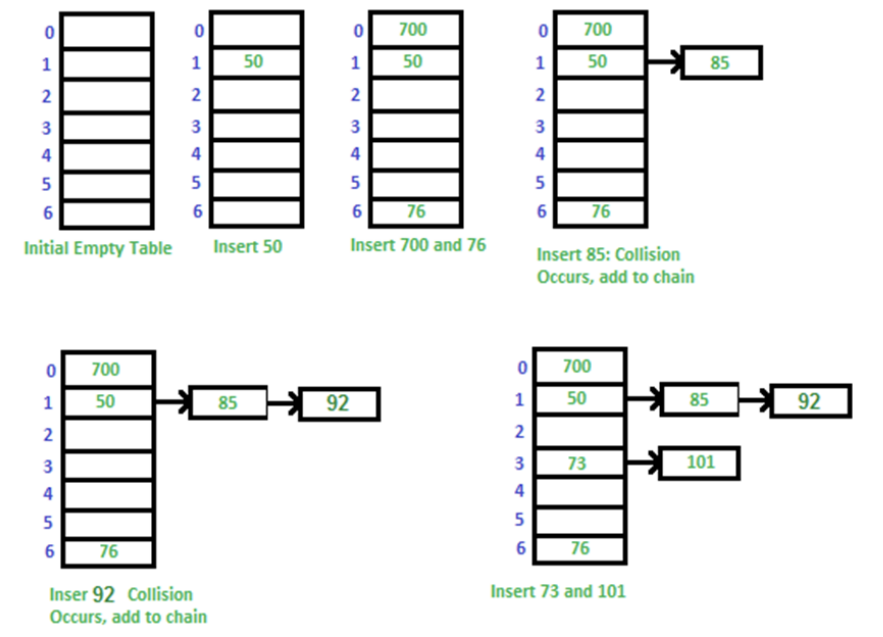

# 해시 테이블 (Hash Table)

> 큰 범위를 가진 각양각색의 데이터들을 해싱을 통해 한정된 범위의 정수값을 가진 해시로 만들고, 해시라는 키에 대응하여 원본 데이터들을 매핑시켜놓은 테이블



### 1. 해시, 해싱, 해시함수

- 해시: 다양한 길이를 가진 데이터를 고정된 길이를 가진 데이터로 매핑(mapping)한 값
- 해싱: 임의의 데이터를 해시로 바꿔주는 일이며, 해시 함수가 이를 담당
- 해시 함수: 임의의 데이터를 입력으로 받아 일정한 길이의 데이터로 바꿔주는 함수

### 2. 간단한 해시 함수 실습 -1



- 해시함수로 인해 해싱된 해시들은 0~19 사이의 한정된 범위의 값을 가지게 된다
- % 연산자를 사용하면 고정된 범위를 가진 요소들을 만들 수 있다

```cpp
let a = [1, 2, 42, 4, 12, 14, 17, 13, 37]
const hashf = num => num % 20
a = a.map(e => hashf(e))
console.log(a)
```

- 여기서 2라는 해시 값에는 data 2, 42가 할당됨 -> `해시 충돌`
- 해시 충돌이 잘 발생하지 않도록, 하나의 해시에는 하나의 값만 할당되도록 해시 함수를 잘 만들어야 한다

### 3. 간단한 해시 함수 실습 -2

- 숫자가 아닌 문자열을 기반으로 정수값의 해시를 만들어낼 수도 있다

```cpp
let a = ["dopa", "paka", "ralo"]
const hashf = (str, size) => {
    let hash = 3;
    for(let i = 0; i < str.length; i++){
        hash *= str.charCodeAt(i)
        hash %= size  // 고정된 범위로 만듦
    }
    return hash
}
a = a.map(e => hashf(e, 20))
console.log(a)
console.log('a'.charCodeAt(0)) // 아스키코드 A = 65, a = 97
// [ 0, 8, 12 ]  // ["dopa", "paka", "ralo"] 문자열이 해시 함수를 통해 이렇게 변함
// 97
```

### 4. 간단한 해시 함수 실습 -3

- 해시테이블에서의 해시 함수는 정수 타입의 값을 반환할 때 쓰인다. 그러나 해시는 사실 데이터베이스에 개인정보를 암호화하여 저장할 때 쓰이기도 한다

- 대표적으로 `MD5`와 `bcrypt` 해시 알고리즘이 존재
  - MD5: 레인보우 테이블(해시 함수로 만들 수 있는 모든 해시를 담은 테이블)을 통한 취약점이 있기 때문에 잘 쓰이지 않음
  - bcrypt(비크립트): db에서 값을 암호화하여 저장할 때 가장 많이 쓰이는 알고리즘

### 5. 해시 테이블의 시간 복잡도

> 해시 테이블은 최악의 시간 복잡도와 평균 시간 복잡도의 차이가 크다

#### 평균 시간 복잡도

- 해당 키를 기반으로 배열에서 인덱스로 접근하듯이 접근할 수 있어서 평균적으로 O(1)의 시간복잡도를 가짐
- 참조, 탐색, 삽입, 삭제 : O(1)

#### 최악의 시간 복잡도

- 해시 테이블에서 충돌이 많이 일어난다면, 해당 해시값이 같은 모든 요소들을 탐색해야 하므로 O(n)의 시간복잡도가 걸림

- 참조, 탐색, 삽입, 삭제 : O(n)

### 6. 해시 테이블의 충돌(collision) 문제 해결하기

> 해시 테이블의 충돌문제는 거의 무조건 발생
> 아주 큰 해시 테이블을 형성한다 해도 birthday paradox에 의해 충돌이 발생할 확률이 높다

- 같은 방에 생일이 같은 사람이 2명 이상일 확률이 50% 넘는 기준 =23명

#### 체이닝

> 충돌 시 연결 리스트에 할당하고, 충돌 시 연결리스트를 탐색하는 기법

- 장점: 구현이 간단하며, 해시 테이블에 많은 데이터를 집어넣을 수 있다
- 단점: 연결 리스트 기반이라 캐시 성능이 좋지 않다. 체인이 길어지면 최악의 경우 O(n)

- 이 때 연결리스트 뿐만 아니라, 동적배열, 균형잡힌 트리인 레드 블랙트리가 사용되며 java8 이상에서는 요소의 수가 특정 임게값을 초과하면 연결리스트가 아닌 레드 블랙트리를 hashmap에 사용한다
  - O(n)의 시간 복잡도를 O(logn)으로 개선



#### 개방 주소법 (Open Addressing)

> 충돌 시 다른 버켓에 데이터를 삽입하는 기법. 선형 탐색, 제곱 탐색, 이중해시 방법

1. 선형 탐색(Linear Probing)

- 해시 충돌 시 다음 버켓, 혹은 몇 개를 선형적을 건너뛰어 데이터를 삽입

2. 제곱 탐색(Quadratic Probing)

- 해시 충돌 시 1부터 연속적인 수를 만들며 해당 수의 제곱만큼 건너뛴 버켓에 데이터를 삽입 ex) 1,4,9,16...키우면서 빈 공간을 찾음

3. 이중 해싱(Double Hashing)

- 해시 충돌 시 다른 해시함수를 한 번더 적용한 결과를 이용해서 데이터를 삽입
