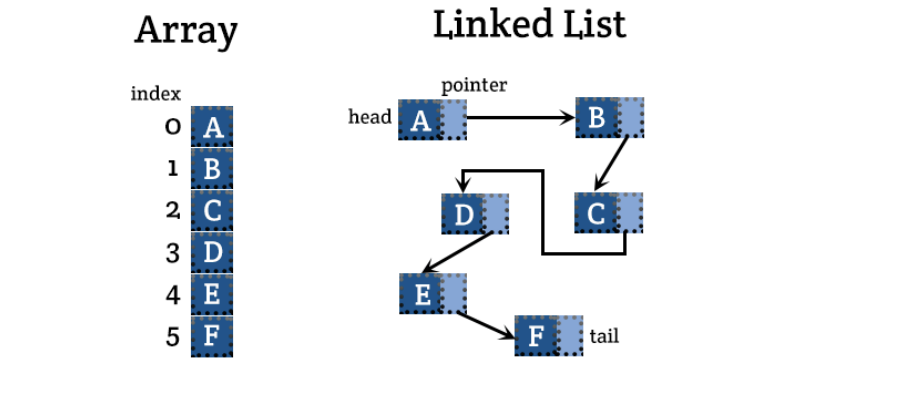

# 배열(Array)과 연결리스트(Linked List)의 차이 ⭐



| 비교 기준                  | 배열   | 연결 리스트 |
| -------------------------- | ------ | ----------- |
| 메모리공간                 | 연속 o | 연속 X      |
| 삽입/삭제(맨 끝 맨앞 제외) | O(n)   | O(1)        |
| n번째 요소 참조            | O(1)   | O(n)        |
| 탐색                       | O(n)   | O(n)        |

> 결론: 데이터의 추가와 삭제가 많을 경우 연결 리스트, 참조가 많을 경우 배열을 사용하는 것이 좋다

### 예시

- Q: 로또 번호 7개를 셔플(순서를 섞을)할 때 어떤 자료구조로 구축해야 하며 로직은 어떻게 될까요?

#### 로직

- 셔플에 필요한 로직은 탐색과 swap. 7개의 수를 자유롭게 탐색해서 해당 2개의 수를 swap 하는 것을 반복해야 한다

#### 자료구조 결정 플로우

- 삽입 삭제 필요 X: 연결리스트 제외
- 자유로히 탐색해서 swap 해야 하므로 랜덤 접근이 불가능한 스택 큐는 제거
- 탐색에 걸리는 시간 복잡도가 O(1)인 배열 사용

```java
import java.util.Random;
import java.util.Arrays;
public class ShuffleRand {
    static void randomize(int arr[]) {
        int n = arr.length;
        Random r = new Random();
        for (int i = n - 1; i > 0; i--) {
            int j = r.nextInt(i + 1);
            int temp = arr[i];
            arr[i] = arr[j];
            arr[j] = temp;
        }
        System.out.println(Arrays.toString(arr));
    }

    public static void main(String[] args) {
        int[] arr = {
            1,
            2,
            3,
            4,
            5,
            6,
            7
        };
        randomize(arr);
    }
}

```
