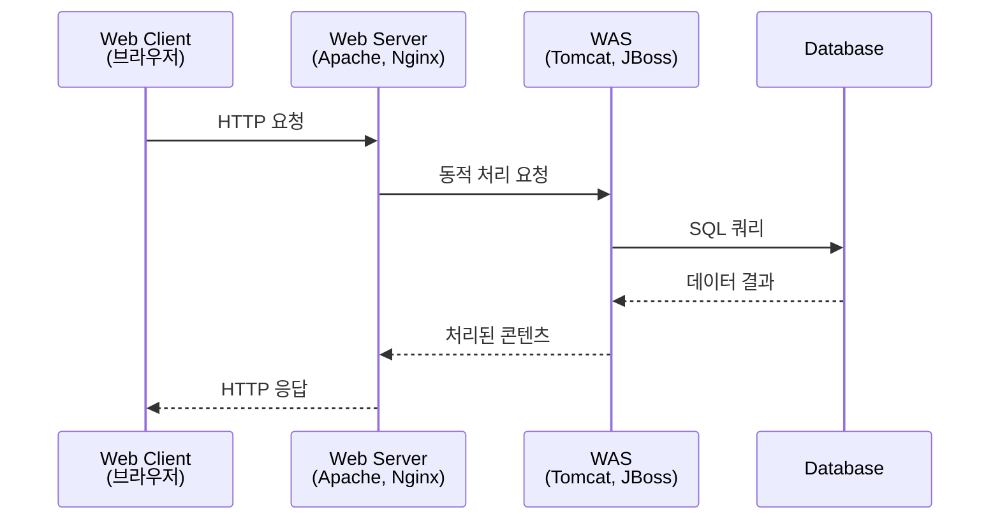
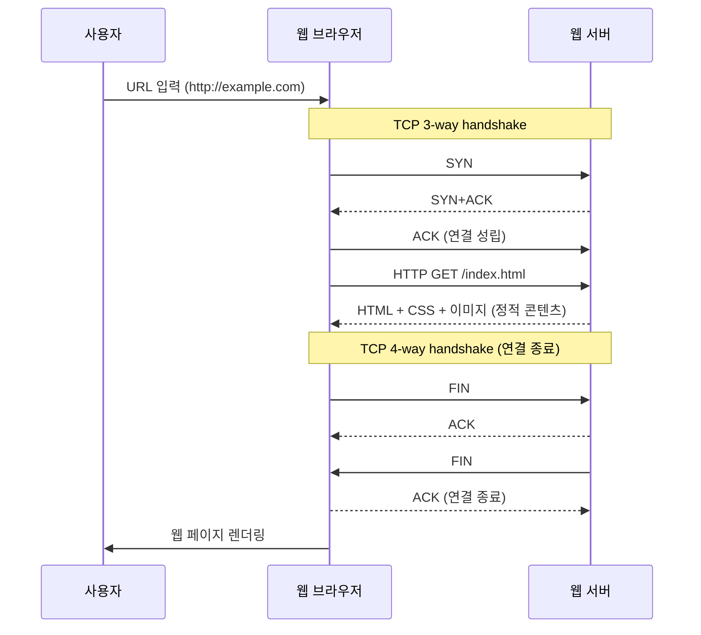
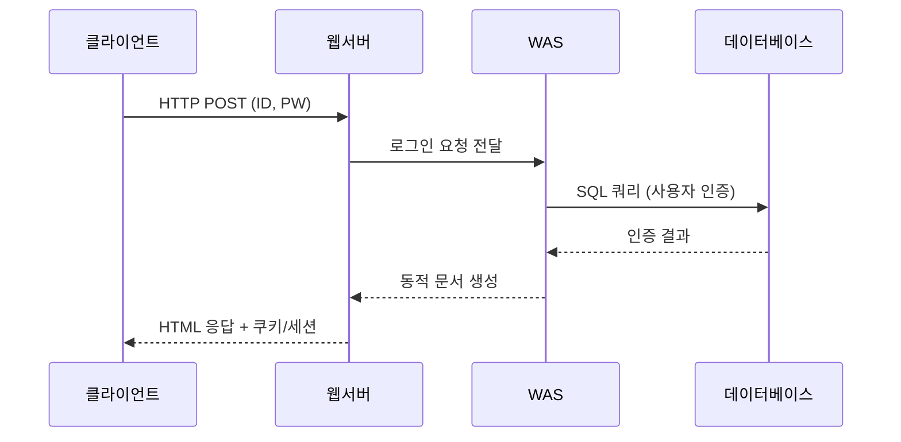

# 웹 서비스 구조와 운영체제 기술

## 웹 서비스 구조 - 기본 구조

### URI 과 URL
  - uniform resource identifier (더 큰 개념)
  - uniform resource locator
  - 예시
    - Protocol://Address:PortNumber/path(or filename)?Parameter=value
    - http://www.test.co.kr/course.do?cmd=search&searchKeyword=Test
  

### 3-Tier 아키텍처



#### 각 계층별 정의와 역할

**1. Web Client (웹 클라이언트)**
- **정의**: 사용자가 웹 서비스에 접근하기 위해 사용하는 인터페이스
- **구성**: 웹 브라우저 (Chrome, Firefox, Safari), 모바일 앱
- **역할**: UI 제공, 사용자 입력 처리, HTTP 요청/응답 처리

**2. Web Server (웹 서버) - 데이터 송수신 주체**
- **정의**: 정적 콘텐츠 처리 및 클라이언트 요청 라우팅
- **구성**: Apache, Nginx, IIS
- **역할**: 정적 파일 서비스, 로드 밸런싱, SSL/TLS 처리, 리버스 프록시

**3. WAS (Web Application Server) - 데이터 처리 주체**
- **정의**: 동적 콘텐츠 생성 및 비즈니스 로직 처리
- **구성**: Tomcat, JBoss, WebLogic, WebSphere
- **역할**: 비즈니스 로직 실행, 동적 콘텐츠 생성, RESTful API 제공, 세션 관리

**4. Database**
- **역할**: 영구 데이터 저장, 트랜잭션 처리
- **연결 방식**: JDBC, ODBC, ADO.NET, PDO

## 웹 서비스 구조 - 기본

### WEB = HTTP + HTML

#### 기본 개념
- **HTTP** (HyperText Transfer Protocol): 하이퍼텍스트 전달 프로토콜
  - 클라이언트와 서버 간 데이터 통신을 위한 규약
  - 요청(Request)과 응답(Response) 기반
  - 기본적으로 Stateless (무상태) 특성

- **HTML** (HyperText Markup Language): 문서 구조화 언어
  - 태그(Tag) 기반으로 문서 구조 정의
  - 웹 페이지의 내용과 구조를 표현

- **WEB**: HTTP 프로토콜을 통해 HTML 문서를 전달하는 시스템

### HTTP 1.0 통신 과정

#### 시퀀스 다이어그램



#### HTTP 1.0의 특징과 문제점

**정적 콘텐츠 처리**
- HTML, CSS, JavaScript, 이미지 등 정적 파일 전송
- 각 리소스마다 별도의 TCP 연결 필요
- 연결 → 요청 → 응답 → 연결 종료 반복

**Stateless의 한계**
- 서버는 클라이언트의 이전 요청을 기억하지 않음
- 매번 새로운 연결을 생성해야 함
- TCP 연결 오버헤드로 인한 성능 저하

**개선 필요성**
- 한 번의 연결로 여러 리소스를 요청하는 방법 필요
- → HTTP 1.1에서 Keep-Alive, Persistent Connection 도입
- → HTTP 2.0에서 Multiplexing 지원

## 웹 서비스 구조 - 진화 과정

### 1단계: 정적 웹 (Static Web)
- **구성**: HTML + CSS + 이미지
- **특징**: 서버에서 미리 작성된 파일만 전송
- **한계**: 사용자 상호작용 불가, 개인화 불가

### 2단계: 동적 웹 + JavaScript
- **추가 요소**: JavaScript 도입
- **JavaScript 특징**:
  - 저장 위치: 서버
  - 실행 위치: 클라이언트 (브라우저 내 JS 엔진)
- **처리 과정**:
  1. HTML, CSS 구문 분석
  2. 이미지 렌더링
  3. JavaScript 엔진으로 스크립트 해석 및 실행
- **장점**: 페이지에 동적 움직임 부여

### 3단계: 양방향 상호작용 도입
#### 문제점
- 기존: 클라이언트 ↔ 웹서버 간 단방향 소통
- 필요: 양방향 상호작용 ⇒ **상태 관리** 필요

#### 상태 관리 솔루션
**클라이언트 측**
- **쿠키 (Cookie)**: Key-Value 형태의 상태 저장
- **로컬 스토리지**: 브라우저 내 데이터 저장

**서버 측**
- **데이터베이스**: 사용자 정보 및 상태 영구 저장
- HTTP Stateless 특성 극복

#### 로그인 과정 예시


### 4단계: API 기반 아키텍처 (현재)
#### 패러다임 변화
- **기존**: 서버에서 완성된 HTML 문서 응답
- **현재**: 서버에서 데이터(JSON/XML)만 응답

#### 장점
- **View 의존성 제거**: 다양한 기기/브라우저 환경 대응
- **역할 분리**:
  - 클라이언트: UI 렌더링 담당 (Vue, React, Angular)
  - WAS: 비즈니스 로직 및 API 제공

#### RESTful API
- **CRUD 작업**: Create, Read, Update, Delete
- **HTTP 메소드**: GET, POST, PUT, DELETE
- **데이터 형식**: JSON, XML


## 보안 아키텍처

### 보안 계층 구조
```
[클라이언트] ↔ [IPS] ↔ [SSL] ↔ [WAF] ↔ [Web Server] ↔ [WAS] ↔ [Database]
                ↑                    ↑
            방화벽              WAF 추가 배치 가능
```

### 주요 보안 위협과 대응

#### 1. SQL 인젝션 (SQL Injection)
- **공격**: 사용자 입력(ID, PW)에 SQL 구문 삽입
- **예시**: `' OR 1=1 --`
- **대응**:
  - **WAF**: Web Application Firewall에서 차단
  - **WAS 코드 레벨**: Prepared Statement, 입력 검증

#### 2. XSS (Cross-Site Scripting)
- **공격**: 사용자 입력에 JavaScript 코드 삽입
- **예시**: `<script>alert('XSS')</script>`
- **대응**:
  - 입력값 검증 및 이스케이프 처리
  - CSP (Content Security Policy) 적용

### 보안 솔루션

#### WAF (Web Application Firewall)
- **배치 위치**:
  - 클라이언트 ↔ Web Server 사이
  - Web Server ↔ WAS 사이 (선택적)
- **기능**: 웹 애플리케이션 계층 공격 차단

#### 기타 보안 요소
- **IPS** (Intrusion Prevention System): 침입 차단
- **SSL/TLS**: 데이터 암호화
- **방화벽**: 네트워크 레벨 보안

## 운영체제 기술

### JVM (Java Virtual Machine)
- **역할**: Java 바이트코드 실행 환경
- **구성**:
  - Heap Memory: 객체 저장
  - Stack Memory: 메소드 호출 정보
  - Method Area: 클래스 정보

### 스프링 프레임워크
- **컨테이너**: IoC (Inversion of Control) 컨테이너
- **특징**: 의존성 주입(DI), AOP 지원

### 커널 모드 vs 유저 모드
- **유저 모드**: 애플리케이션 실행 영역
- **커널 모드**: 운영체제 핵심 기능 실행 영역
- **시스템 콜**: 유저 모드에서 커널 모드로 전환

## 모니터링 및 APM

### APM (Application Performance Monitoring)
- **목적**: 애플리케이션 성능 및 장애 모니터링

### 주요 APM 도구
- **제니퍼 (Jennifer)**: 국산 APM 솔루션
- **스카우터 (Scouter)**: 오픈소스 APM
- **X-Log**: 성능 로그 분석

### 모니터링 대상
- **데이터베이스 응답 시간**
- **JVM 상태** (메모리, GC, 스레드)
- **트랜잭션 성능**
- **에러율 및 처리량**


