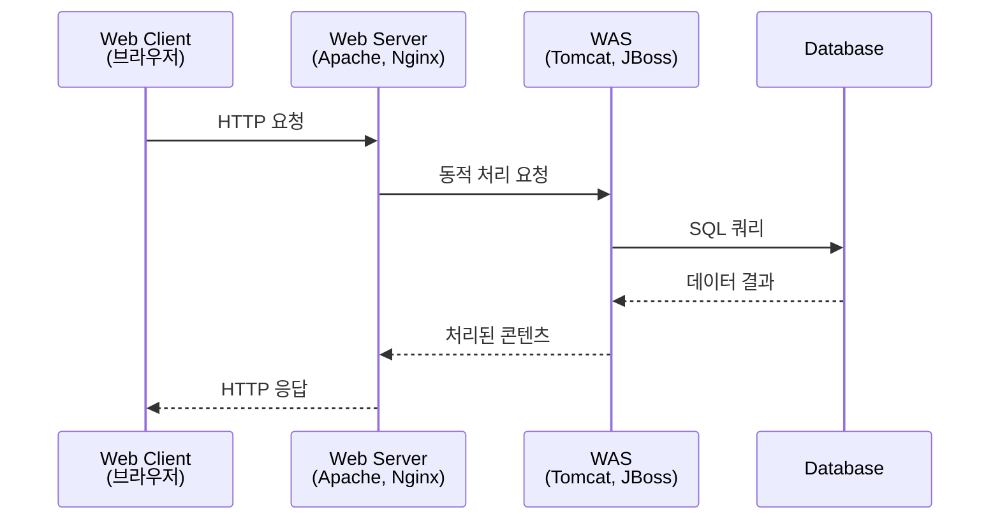
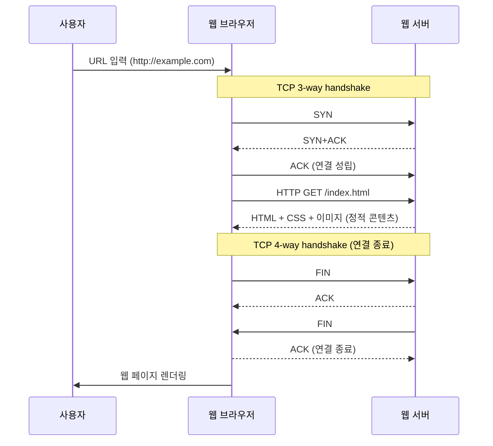

# 웹 서비스 구조와 운영체제 기술

## 웹 서비스 구조 - 기본 구조

### URI 과 URL
  - uniform resource identifier (더 큰 개념)
  - uniform resource locator
  - 예시
    - Protocol://Address:PortNumber/path(or filename)?Parameter=value
    - http://www.test.co.kr/course.do?cmd=search&searchKeyword=Test
  

### 웹 서비스 기본 구조



#### 1. Web Client (웹 클라이언트)
- **정의**: 사용자가 웹 서비스에 접근하기 위해 사용하는 인터페이스
- **구성 요소**: 웹 브라우저 (Chrome, Firefox, Safari 등), 모바일 앱
- **역할**:
  - 사용자 인터페이스 제공
  - 사용자 입력 처리
  - HTTP 요청 생성 및 전송
  - 서버로부터 받은 응답 렌더링

#### 2. Web Server (웹 서버)
- **정의**: 정적 콘텐츠를 처리하고 클라이언트 요청을 적절한 서버로 라우팅하는 서버
- **구성 요소**: Apache, Nginx, IIS 등
- **역할**:
  - 정적 파일 서비스 (HTML, CSS, JS, 이미지 등)
  - 클라이언트 요청 수신 및 처리
  - 로드 밸런싱
  - SSL/TLS 처리
  - 리버스 프록시 역할

#### 3. WAS (Web Application Server)
- **정의**: 동적 콘텐츠를 생성하고 비즈니스 로직을 처리하는 애플리케이션 서버
- **구성 요소**: Tomcat, JBoss, WebLogic, WebSphere 등
- **역할**:
  - 동적 웹 페이지 생성
  - 비즈니스 로직 실행
  - 데이터베이스 연결 및 트랜잭션 처리
  - 세션 관리
  - 보안 처리

### 데이터 교환 흐름

```
[Web Client] ←→ [Web Server] ←→ [WAS] ←→ [Database]
```

#### 1. 클라이언트 → 웹 서버
- **프로토콜**: HTTP/HTTPS
- **데이터**: HTTP 요청 (GET, POST, PUT, DELETE 등)
- **내용**: URL, 헤더, 파라미터, 폼 데이터

#### 2. 웹 서버 → WAS
- **프로토콜**: AJP (Apache JServ Protocol), HTTP
- **데이터**: 가공된 요청 정보
- **내용**: 비즈니스 로직 처리를 위한 요청 데이터

#### 3. WAS → 데이터베이스
- **프로토콜**: JDBC, ODBC 등 DB 커넥션
- **데이터**: SQL 쿼리, 트랜잭션
- **내용**: 데이터 조회, 삽입, 수정, 삭제 요청

#### 4. 응답 흐름 (역순)
- 데이터베이스 → WAS: 쿼리 결과
- WAS → 웹 서버: 처리된 동적 콘텐츠 (JSP, Servlet 등)
- 웹 서버 → 클라이언트: 완성된 HTML 페이지

## 웹 서비스 구조 - 확장 첫 번째

### WEB = HTTP + HTML

#### 기본 개념
- **HTTP** (HyperText Transfer Protocol): 하이퍼텍스트 전달 프로토콜
  - 클라이언트와 서버 간 데이터 통신을 위한 규약
  - 요청(Request)과 응답(Response) 기반
  - 기본적으로 Stateless (무상태) 특성

- **HTML** (HyperText Markup Language): 문서 구조화 언어
  - 태그(Tag) 기반으로 문서 구조 정의
  - 웹 페이지의 내용과 구조를 표현

- **WEB**: HTTP 프로토콜을 통해 HTML 문서를 전달하는 시스템

### HTTP 1.0 통신 과정

#### 시퀀스 다이어그램



#### HTTP 1.0의 특징과 문제점

**정적 콘텐츠 처리**
- HTML, CSS, JavaScript, 이미지 등 정적 파일 전송
- 각 리소스마다 별도의 TCP 연결 필요
- 연결 → 요청 → 응답 → 연결 종료 반복

**Stateless의 한계**
- 서버는 클라이언트의 이전 요청을 기억하지 않음
- 매번 새로운 연결을 생성해야 함
- TCP 연결 오버헤드로 인한 성능 저하

**개선 필요성**
- 한 번의 연결로 여러 리소스를 요청하는 방법 필요
- → HTTP 1.1에서 Keep-Alive, Persistent Connection 도입
- → HTTP 2.0에서 Multiplexing 지원


